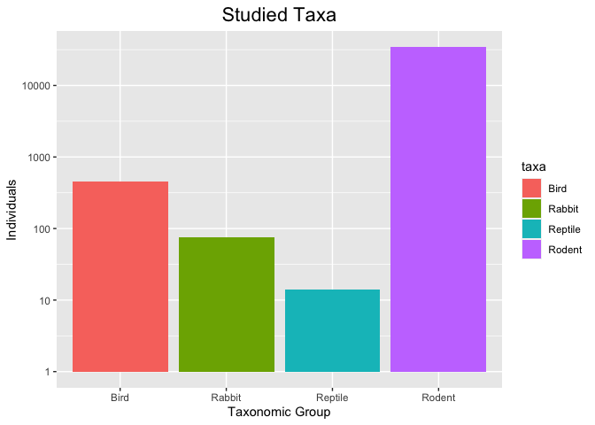
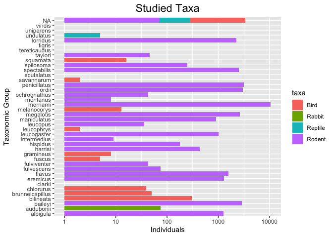
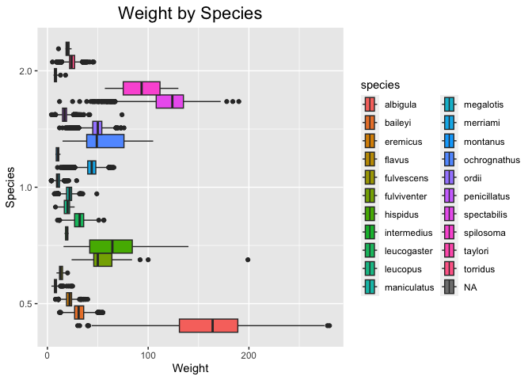
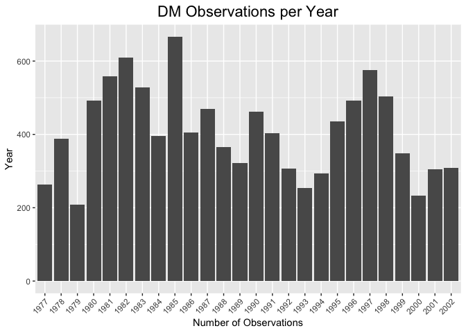

## Instructions
Answer the following questions and complete the exercises in RMarkdown. Please embed all of your code and push your final work to your repository. Your final lab report should be organized, clean, and run free from errors. Remember, you must remove the `#` for the included code chunks to run. Be sure to add your name to the author header above. For any included plots, make sure they are clearly labeled. You are free to use any plot type that you feel best communicates the results of your analysis.  

Make sure to use the formatting conventions of RMarkdown to make your report neat and clean!  

## Load the libraries

```r
library(tidyverse)
library(janitor)
library(naniar)
```

## Desert Ecology
For this assignment, we are going to use a modified data set on [desert ecology](http://esapubs.org/archive/ecol/E090/118/). The data are from: S. K. Morgan Ernest, Thomas J. Valone, and James H. Brown. 2009. Long-term monitoring and experimental manipulation of a Chihuahuan Desert ecosystem near Portal, Arizona, USA. Ecology 90:1708.

```r
deserts <- read_csv("data/surveys_complete.csv") %>% clean_names()
```

```
## Rows: 34786 Columns: 13
## ── Column specification ────────────────────────────────────────────────────────
## Delimiter: ","
## chr (6): species_id, sex, genus, species, taxa, plot_type
## dbl (7): record_id, month, day, year, plot_id, hindfoot_length, weight
## 
## ℹ Use `spec()` to retrieve the full column specification for this data.
## ℹ Specify the column types or set `show_col_types = FALSE` to quiet this message.
```

1. Use the function(s) of your choice to get an idea of its structure, including how NA's are treated. Are the data tidy? 

```r
names(deserts)
```

```
##  [1] "record_id"       "month"           "day"             "year"           
##  [5] "plot_id"         "species_id"      "sex"             "hindfoot_length"
##  [9] "weight"          "genus"           "species"         "taxa"           
## [13] "plot_type"
```


```r
summary(deserts)
```

```
##    record_id         month             day            year         plot_id     
##  Min.   :    1   Min.   : 1.000   Min.   : 1.0   Min.   :1977   Min.   : 1.00  
##  1st Qu.: 8964   1st Qu.: 4.000   1st Qu.: 9.0   1st Qu.:1984   1st Qu.: 5.00  
##  Median :17762   Median : 6.000   Median :16.0   Median :1990   Median :11.00  
##  Mean   :17804   Mean   : 6.474   Mean   :16.1   Mean   :1990   Mean   :11.34  
##  3rd Qu.:26655   3rd Qu.:10.000   3rd Qu.:23.0   3rd Qu.:1997   3rd Qu.:17.00  
##  Max.   :35548   Max.   :12.000   Max.   :31.0   Max.   :2002   Max.   :24.00  
##                                                                                
##   species_id            sex            hindfoot_length     weight      
##  Length:34786       Length:34786       Min.   : 2.00   Min.   :  4.00  
##  Class :character   Class :character   1st Qu.:21.00   1st Qu.: 20.00  
##  Mode  :character   Mode  :character   Median :32.00   Median : 37.00  
##                                        Mean   :29.29   Mean   : 42.67  
##                                        3rd Qu.:36.00   3rd Qu.: 48.00  
##                                        Max.   :70.00   Max.   :280.00  
##                                        NA's   :3348    NA's   :2503    
##     genus             species              taxa            plot_type        
##  Length:34786       Length:34786       Length:34786       Length:34786      
##  Class :character   Class :character   Class :character   Class :character  
##  Mode  :character   Mode  :character   Mode  :character   Mode  :character  
##                                                                             
##                                                                             
##                                                                             
## 
```

```r
deserts <- deserts %>% 
  replace_with_na(replace = list(species="sp."))
```


```r
miss_var_summary(deserts)
```

```
## # A tibble: 13 × 3
##    variable        n_miss pct_miss
##    <chr>            <int>    <dbl>
##  1 hindfoot_length   3348    9.62 
##  2 weight            2503    7.20 
##  3 sex               1748    5.03 
##  4 species             86    0.247
##  5 record_id            0    0    
##  6 month                0    0    
##  7 day                  0    0    
##  8 year                 0    0    
##  9 plot_id              0    0    
## 10 species_id           0    0    
## 11 genus                0    0    
## 12 taxa                 0    0    
## 13 plot_type            0    0
```

```r
deserts
```

```
## # A tibble: 34,786 × 13
##    record_id month   day  year plot_id species_id sex   hindfoot_length weight
##        <dbl> <dbl> <dbl> <dbl>   <dbl> <chr>      <chr>           <dbl>  <dbl>
##  1         1     7    16  1977       2 NL         M                  32     NA
##  2         2     7    16  1977       3 NL         M                  33     NA
##  3         3     7    16  1977       2 DM         F                  37     NA
##  4         4     7    16  1977       7 DM         M                  36     NA
##  5         5     7    16  1977       3 DM         M                  35     NA
##  6         6     7    16  1977       1 PF         M                  14     NA
##  7         7     7    16  1977       2 PE         F                  NA     NA
##  8         8     7    16  1977       1 DM         M                  37     NA
##  9         9     7    16  1977       1 DM         F                  34     NA
## 10        10     7    16  1977       6 PF         F                  20     NA
## # ℹ 34,776 more rows
## # ℹ 4 more variables: genus <chr>, species <chr>, taxa <chr>, plot_type <chr>
```
Yes the data does look tidy. Each of the variables does not contain additional information. And each observation is unique in its own row/cell. 

2. How many genera and species are represented in the data? What are the total number of observations? Which species is most/ least frequently sampled in the study?

```r
names(deserts)
```

```
##  [1] "record_id"       "month"           "day"             "year"           
##  [5] "plot_id"         "species_id"      "sex"             "hindfoot_length"
##  [9] "weight"          "genus"           "species"         "taxa"           
## [13] "plot_type"
```


```r
deserts %>% 
  n_distinct("genus")
```

```
## [1] 34786
```


```r
deserts %>% 
  n_distinct("species")
```

```
## [1] 34786
```

In the data, we have a total of 34786 distinct observations for the `genus` and `species` variables. 


```r
deserts %>% 
  count(species) %>% 
  arrange(desc(n))
```

```
## # A tibble: 40 × 2
##    species          n
##    <chr>        <int>
##  1 merriami     10596
##  2 penicillatus  3123
##  3 ordii         3027
##  4 baileyi       2891
##  5 megalotis     2609
##  6 spectabilis   2504
##  7 torridus      2249
##  8 flavus        1597
##  9 eremicus      1299
## 10 albigula      1252
## # ℹ 30 more rows
```
The most studied species, based on the number of recorded observations is the merriami species. The least studied species is a combination of different species with only 1 recorded observation, this includes the clarki, scutalatus, tereticaudus, tigris, uniparens, and the viridis. 

3. What is the proportion of taxa included in this study? Show a table and plot that reflects this count.
Table: 

```r
deserts %>% 
  count(taxa) %>% 
  arrange(desc(n))
```

```
## # A tibble: 4 × 2
##   taxa        n
##   <chr>   <int>
## 1 Rodent  34247
## 2 Bird      450
## 3 Rabbit     75
## 4 Reptile    14
```
As shown above, rodents are the most studied taxa in this data. 

Plot: 

```r
deserts %>% 
  ggplot(aes(x=taxa,fill=taxa))+
  geom_bar()+
  scale_y_log10()+
  labs(title = "Studied Taxa",
       x= "Taxonomic Group",
       y= "Individuals")+
  theme(plot.title=element_text(size=rel(1.5),hjust=0.5))
```

<!-- -->
Among the studied taxa, we can see rodents are the most abundantly studied. 

4. For the taxa included in the study, use the fill option to show the proportion of individuals sampled by `plot_type.`

```r
deserts %>% 
  ggplot(aes(x=species,fill=taxa))+
  geom_bar()+
  coord_flip()+
  scale_y_log10()+
  labs(title = "Studied Taxa",
       x= "Taxonomic Group",
       y= "Individuals")+
  theme(plot.title=element_text(size=rel(1.5),hjust=0.5))
```

<!-- -->
While crowded, we can see the abundance of purple bars that represent the rodent taxa in comparison to the other taxa, indicating it to be the most highly studied taxa within the studied species. 

5. What is the range of weight for each species included in the study? Remove any observations of weight that are NA so they do not show up in the plot.


```r
deserts %>% 
  filter(!weight=="NA") %>% 
  ggplot(aes(x=weight, fill=species))+
  geom_boxplot(na.rm = T, position="dodge")+
  scale_y_log10()+
  labs(title = "Weight by Species",
       x= "Weight",
       y= "Species")+
  theme(plot.title=element_text(size=rel(1.5),hjust=0.5))
```

<!-- -->

6. Add another layer to your answer from #5 using `geom_point` to get an idea of how many measurements were taken for each species.

```r
deserts %>% 
  filter(!weight=="NA") %>% 
  ggplot(aes(x=weight,y=species))+
  geom_point(na.rm = T)+
  labs(title = "Weight by Species",
       x= "Weight",
       y= "Species")+
  theme(plot.title=element_text(size=rel(1.5),hjust=0.5))
```

<!-- -->

7. [Dipodomys merriami](https://en.wikipedia.org/wiki/Merriam's_kangaroo_rat) is the most frequently sampled animal in the study. How have the number of observations of this species changed over the years included in the study?


```r
names(deserts)
```

```
##  [1] "record_id"       "month"           "day"             "year"           
##  [5] "plot_id"         "species_id"      "sex"             "hindfoot_length"
##  [9] "weight"          "genus"           "species"         "taxa"           
## [13] "plot_type"
```


```r
deserts %>% 
  filter(species_id=="DM") %>% 
  group_by(year) %>% 
  summarise(n_samples=n()) %>% 
  ggplot(aes(x=as.factor(year),y=n_samples))+
    geom_col()+
  theme(axis.text.x = element_text(angle=45, hjust=1))+
  labs(title = "DM Observations per Year",
       x="Number of Observations",
       y= "Year")+
   theme(plot.title=element_text(size=rel(1.5),hjust=0.5))
```

<!-- -->

8. What is the relationship between `weight` and `hindfoot` length? Consider whether or not over plotting is an issue.

```r
deserts %>% 
  ggplot(aes(x=weight,y=hindfoot_length, color=species))+
  geom_point(na.rm=T,size=0.5)+
  geom_smooth(method=lm,se=F)+
  scale_y_log10()+
   theme(axis.text.x = element_text(angle=45, hjust=1))+
  labs(title = "Weight and Hindfoot Length",
       x="Weight",
       y= "Hindfoot Length")+
   theme(plot.title=element_text(size=rel(1.5),hjust=0.5))
```

```
## `geom_smooth()` using formula = 'y ~ x'
```

```
## Warning: Removed 4048 rows containing non-finite values (`stat_smooth()`).
```

<!-- -->
Over plotting is an issue with the data. Even with the the log10 scaling, the use of `jitter` instead of `point` to introduce random data into the plot, and making each plot point smaller each of the data points are still close together. Still, we are able to see a general pattern and relationship between the data points form. From this, we can see that hindfoot length will increase with weight, but when a weight of 100 is reached, corresponding hindfoot length will not increase. 

9. Which two species have, on average, the highest weight? Once you have identified them, make a new column that is a ratio of `weight` to `hindfoot_length`. Make a plot that shows the range of this new ratio and fill by sex.

```r
names(deserts)
```

```
##  [1] "record_id"       "month"           "day"             "year"           
##  [5] "plot_id"         "species_id"      "sex"             "hindfoot_length"
##  [9] "weight"          "genus"           "species"         "taxa"           
## [13] "plot_type"
```

```r
deserts %>% 
  group_by(species) %>% 
  filter(!weight=="NA") %>% 
  summarise(mean_weight=mean(weight,na.Rm=T)) %>% 
  arrange(desc(mean_weight))
```

```
## # A tibble: 22 × 2
##    species      mean_weight
##    <chr>              <dbl>
##  1 albigula           159. 
##  2 spectabilis        120. 
##  3 spilosoma           93.5
##  4 hispidus            65.6
##  5 fulviventer         58.9
##  6 ochrognathus        55.4
##  7 ordii               48.9
##  8 merriami            43.2
##  9 baileyi             31.7
## 10 leucogaster         31.6
## # ℹ 12 more rows
```
Albigula and spectabilis are the species with the highest mean weight. 

Plot

```r
deserts %>% 
  filter(species_id=="DS" | species_id =="NL") %>% 
  filter(!weight=="NA" & !hindfoot_length=="NA" & !sex=="NA") %>% 
  mutate(ratio=weight/hindfoot_length) %>%
  select(ratio,species_id,weight,sex) %>% 
  ggplot(aes(x=ratio,fill=sex))+
  geom_boxplot()+
  theme(axis.text.x = element_text(angle=45, hjust=1))+
  labs(title = "Weight to Foot Ratios",
       x="Ratio")+
   theme(plot.title=element_text(size=rel(1.5),hjust=0.5))
```

<!-- -->
Note to self: When specifying the NA exclusions from the data, we must use the `and` command and not the `or` command, because we only want to plot data that does not contain NA values for any of the 3 variables we are interested in plotting. Also, finding the range of variables corresponds to boxplots! 

10. Make one plot of your choice! Make sure to include at least two of the aesthetics options you have learned.

```r
names(deserts)
```

```
##  [1] "record_id"       "month"           "day"             "year"           
##  [5] "plot_id"         "species_id"      "sex"             "hindfoot_length"
##  [9] "weight"          "genus"           "species"         "taxa"           
## [13] "plot_type"
```


```r
options(scipen=999)
```


```r
deserts %>% 
 filter(taxa=="Rodent") %>% 
  filter(plot_type == "Control") %>% 
  filter(!sex== "NA") %>% 
  ggplot(aes(x=species,y=hindfoot_length,fill=sex))+
  geom_boxplot(alpha=0.4)+
  scale_y_log10()+
  coord_flip()+
  labs(title = "Range of Hindfoot Length per Species",
       x="Species",
       y= "Hindfoot Length")+
   theme(plot.title=element_text(size=rel(1.5),hjust=0.5))
```

```
## Warning: Removed 723 rows containing non-finite values (`stat_boxplot()`).
```

<!-- -->
There are multiple taxa (such as Bird or Rabbit) in this data, but for some reason only `rodent` is the only taxa that is working with this code, the table ends up going blank with no data/plot showing at all.  Why? Shouldnt this code work with any taxa I want it to? 

## Push your final code to GitHub!
Please be sure that you check the `keep md` file in the knit preferences. 
