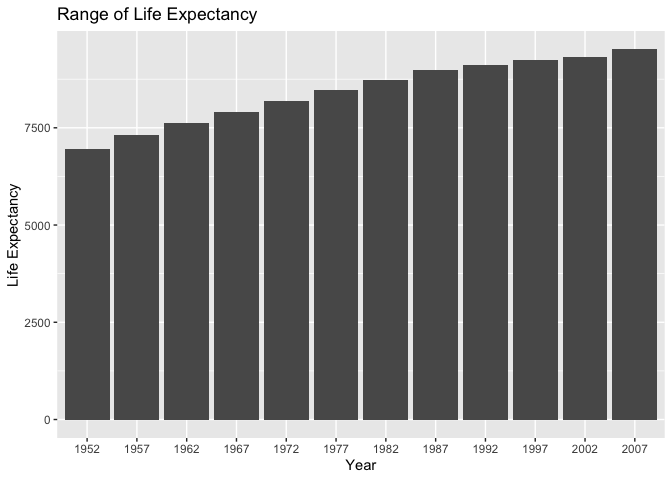
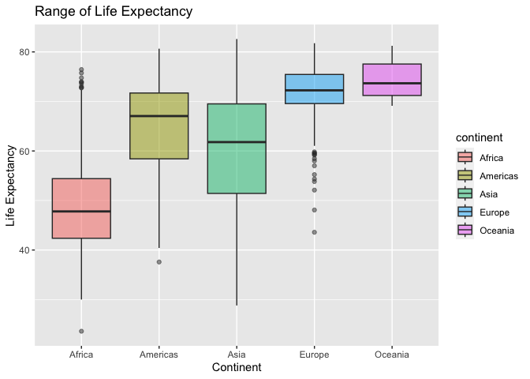
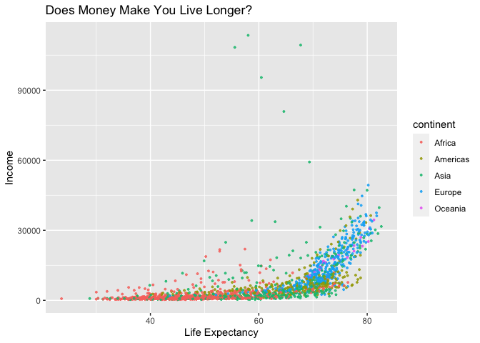
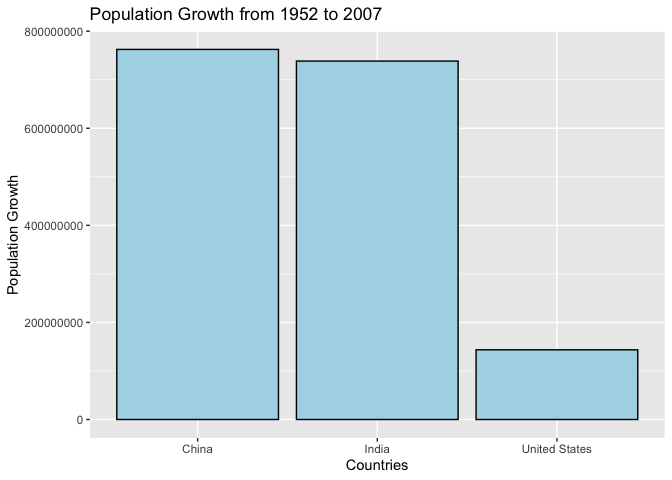
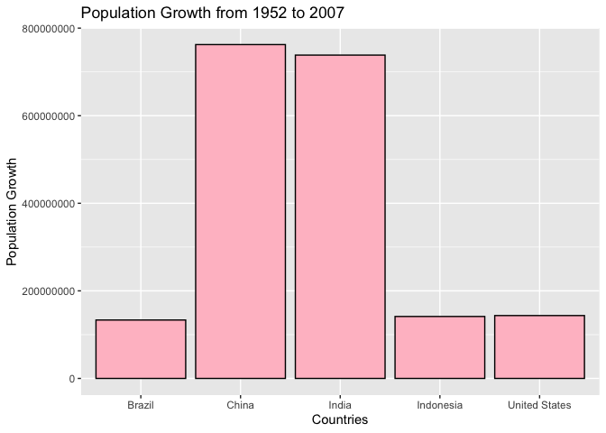
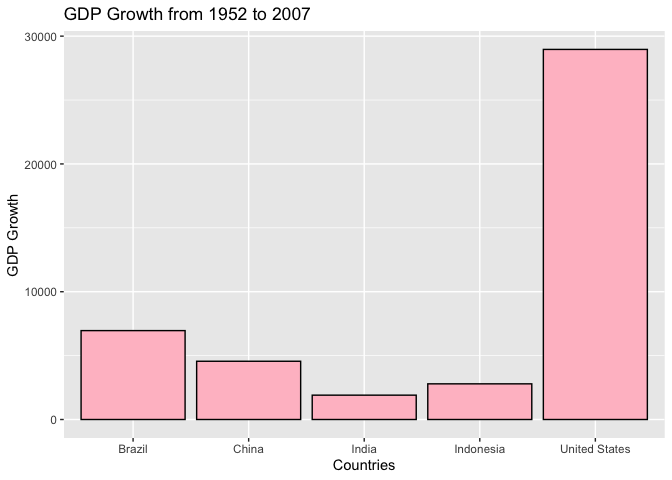
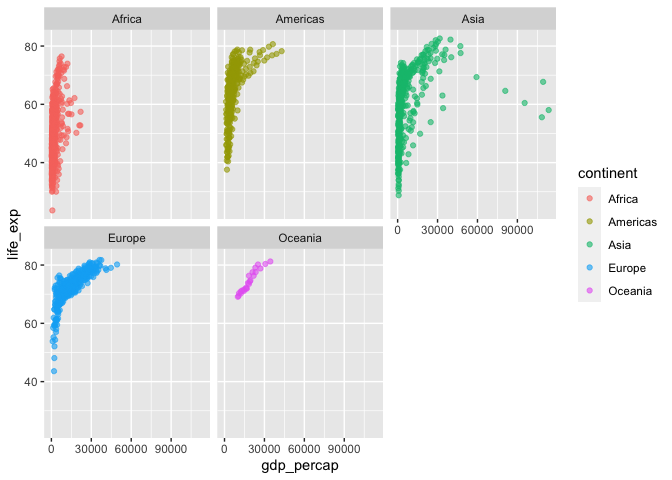

## Instructions
Answer the following questions and complete the exercises in RMarkdown. Please embed all of your code and push your final work to your repository. Your final lab report should be organized, clean, and run free from errors. Remember, you must remove the `#` for the included code chunks to run. Be sure to add your name to the author header above. For any included plots, make sure they are clearly labeled. You are free to use any plot type that you feel best communicates the results of your analysis.  

**In this homework, you should make use of the aesthetics you have learned. It's OK to be flashy!**

Make sure to use the formatting conventions of RMarkdown to make your report neat and clean!  

## Load the libraries

```r
library(tidyverse)
library(janitor)
library(here)
library(naniar)
```


```r
options(scipen = 999)
```

## Resources
The idea for this assignment came from [Rebecca Barter's](http://www.rebeccabarter.com/blog/2017-11-17-ggplot2_tutorial/) ggplot tutorial so if you get stuck this is a good place to have a look.  

## Gapminder
For this assignment, we are going to use the dataset [gapminder](https://cran.r-project.org/web/packages/gapminder/index.html). Gapminder includes information about economics, population, and life expectancy from countries all over the world. You will need to install it before use. This is the same data that we will use for midterm 2 so this is good practice.

```r
#install.packages("gapminder")
library("gapminder")
```
## Questions
The questions below are open-ended and have many possible solutions. Your approach should, where appropriate, include numerical summaries and visuals. Be creative; assume you are building an analysis that you would ultimately present to an audience of stakeholders. Feel free to try out different `geoms` if they more clearly present your results.  

**1. Use the function(s) of your choice to get an idea of the overall structure of the data frame, including its dimensions, column names, variable classes, etc. As part of this, determine how NAs are treated in the data.**  

```r
gapminder <- gapminder %>% clean_names()
gapminder
```

```
## # A tibble: 1,704 × 6
##    country     continent  year life_exp      pop gdp_percap
##    <fct>       <fct>     <int>    <dbl>    <int>      <dbl>
##  1 Afghanistan Asia       1952     28.8  8425333       779.
##  2 Afghanistan Asia       1957     30.3  9240934       821.
##  3 Afghanistan Asia       1962     32.0 10267083       853.
##  4 Afghanistan Asia       1967     34.0 11537966       836.
##  5 Afghanistan Asia       1972     36.1 13079460       740.
##  6 Afghanistan Asia       1977     38.4 14880372       786.
##  7 Afghanistan Asia       1982     39.9 12881816       978.
##  8 Afghanistan Asia       1987     40.8 13867957       852.
##  9 Afghanistan Asia       1992     41.7 16317921       649.
## 10 Afghanistan Asia       1997     41.8 22227415       635.
## # ℹ 1,694 more rows
```


```r
dim(gapminder)
```

```
## [1] 1704    6
```


```r
names(gapminder)
```

```
## [1] "country"    "continent"  "year"       "life_exp"   "pop"       
## [6] "gdp_percap"
```

```r
summary(gapminder)
```

```
##         country        continent        year         life_exp    
##  Afghanistan:  12   Africa  :624   Min.   :1952   Min.   :23.60  
##  Albania    :  12   Americas:300   1st Qu.:1966   1st Qu.:48.20  
##  Algeria    :  12   Asia    :396   Median :1980   Median :60.71  
##  Angola     :  12   Europe  :360   Mean   :1980   Mean   :59.47  
##  Argentina  :  12   Oceania : 24   3rd Qu.:1993   3rd Qu.:70.85  
##  Australia  :  12                  Max.   :2007   Max.   :82.60  
##  (Other)    :1632                                                
##       pop               gdp_percap      
##  Min.   :     60011   Min.   :   241.2  
##  1st Qu.:   2793664   1st Qu.:  1202.1  
##  Median :   7023596   Median :  3531.8  
##  Mean   :  29601212   Mean   :  7215.3  
##  3rd Qu.:  19585222   3rd Qu.:  9325.5  
##  Max.   :1318683096   Max.   :113523.1  
## 
```


```r
glimpse(gapminder)
```

```
## Rows: 1,704
## Columns: 6
## $ country    <fct> "Afghanistan", "Afghanistan", "Afghanistan", "Afghanistan",…
## $ continent  <fct> Asia, Asia, Asia, Asia, Asia, Asia, Asia, Asia, Asia, Asia,…
## $ year       <int> 1952, 1957, 1962, 1967, 1972, 1977, 1982, 1987, 1992, 1997,…
## $ life_exp   <dbl> 28.801, 30.332, 31.997, 34.020, 36.088, 38.438, 39.854, 40.…
## $ pop        <int> 8425333, 9240934, 10267083, 11537966, 13079460, 14880372, 1…
## $ gdp_percap <dbl> 779.4453, 820.8530, 853.1007, 836.1971, 739.9811, 786.1134,…
```
As shown we have a combination of factors, numeric, and categorical data. 

```r
sum(is.na(gapminder))
```

```
## [1] 0
```


```r
miss_var_summary(gapminder)
```

```
## # A tibble: 6 × 3
##   variable   n_miss pct_miss
##   <chr>       <int>    <dbl>
## 1 country         0        0
## 2 continent       0        0
## 3 year            0        0
## 4 life_exp        0        0
## 5 pop             0        0
## 6 gdp_percap      0        0
```
As shown this data does not contain any NA values, nor any placeholder values that should be counted as NAs. The data is neat and follows tidyverse format. 

**2. Among the interesting variables in gapminder is life expectancy. How has global life expectancy changed between 1952 and 2007?**


```r
gapminder %>% 
  mutate(year=as.factor(year)) %>% 
  select(country,year,life_exp) %>% 
  filter(year=="1952"|year=="2007") %>% 
  pivot_wider(names_from ="year",values_from="year")
```

```
## # A tibble: 284 × 4
##    country     life_exp `1952` `2007`
##    <fct>          <dbl> <fct>  <fct> 
##  1 Afghanistan     28.8 1952   <NA>  
##  2 Afghanistan     43.8 <NA>   2007  
##  3 Albania         55.2 1952   <NA>  
##  4 Albania         76.4 <NA>   2007  
##  5 Algeria         43.1 1952   <NA>  
##  6 Algeria         72.3 <NA>   2007  
##  7 Angola          30.0 1952   <NA>  
##  8 Angola          42.7 <NA>   2007  
##  9 Argentina       62.5 1952   <NA>  
## 10 Argentina       75.3 <NA>   2007  
## # ℹ 274 more rows
```
As shown above, we see an average trend of increasing `life_exp` from 1952 to 2007 per each of the analyzed countries. 

**3. How do the distributions of life expectancy compare for the years 1952 and 2007?**

```r
gapminder %>% 
  mutate(year=as.factor(year)) %>% 
  filter(between(year,"1952","2007"))%>%
  ggplot(aes(x=year,y=life_exp))+
  geom_col(na.rm=T)+
  labs(title= "Range of Life Expectancy",
       x="Year",
       y="Life Expectancy")
```

<!-- -->
As shown, we observe a steady increase in life expentancy from 1952 to 2007. 
Note to self: remember that by changing the years to factors instead of numerical data, we must put "" when selecting years we want to filter or specifically analyze. 

**4. Your answer above doesn't tell the whole story since life expectancy varies by region. Make a summary that shows the min, mean, and max life expectancy by continent for all years represented in the data.**
Min, mean, and max can be represented by a boxplot. Note, `summary` here indicates we are looking for a numerical summary 


```r
gapminder %>% 
  mutate(year=as.factor(year)) %>% 
  group_by(continent,year) %>% 
  summarise(min_life_exp=min(life_exp),
            mean_life_exp=mean(life_exp),
            max_life_exp=max(life_exp))
```

```
## `summarise()` has grouped output by 'continent'. You can override using the
## `.groups` argument.
```

```
## # A tibble: 60 × 5
## # Groups:   continent [5]
##    continent year  min_life_exp mean_life_exp max_life_exp
##    <fct>     <fct>        <dbl>         <dbl>        <dbl>
##  1 Africa    1952          30            39.1         52.7
##  2 Africa    1957          31.6          41.3         58.1
##  3 Africa    1962          32.8          43.3         60.2
##  4 Africa    1967          34.1          45.3         61.6
##  5 Africa    1972          35.4          47.5         64.3
##  6 Africa    1977          36.8          49.6         67.1
##  7 Africa    1982          38.4          51.6         69.9
##  8 Africa    1987          39.9          53.3         71.9
##  9 Africa    1992          23.6          53.6         73.6
## 10 Africa    1997          36.1          53.6         74.8
## # ℹ 50 more rows
```
**5. How has life expectancy changed between 1952-2007 for each continent?**

```r
gapminder %>% 
  mutate(year=as.factor(year)) %>% 
  ggplot(aes(x=continent,y=life_exp,fill=continent))+
  geom_boxplot(na.rm=T,alpha=0.5)+
  labs(title= "Range of Life Expectancy",
       x="Continent",
       y="Life Expectancy")
```

<!-- -->
Confusion, if we do not include a certain year to grab the data from, does this mean these box plots are the min,mean,and max from all the data from all the years measured?

**6. We are interested in the relationship between per capita GDP and life expectancy; i.e. does having more money help you live longer?**

```r
names(gapminder)
```

```
## [1] "country"    "continent"  "year"       "life_exp"   "pop"       
## [6] "gdp_percap"
```


```r
gapminder %>% 
   mutate(year=as.factor(year)) %>% 
  ggplot(aes(y=gdp_percap,x=life_exp,color=continent))+
  geom_jitter(size=0.65,alpha=0.8)+
  labs(title= "Does Money Make You Live Longer?",
       x="Life Expectancy",
       y="Income")
```

<!-- -->
There is a subtle trend that shows longer life expectancy can be associated with a higher income. However, additional data is needed to make a more confident conclusion, especially due to the outlier points of younger individuals with higher incomes having shorter life expectancies. 

**7. Which countries have had the largest population growth since 1952?**
Numerical Summary 

```r
gapminder %>% 
  mutate(year=as.factor(year)) %>% 
  select(country,year,pop) %>% 
  filter(year== "1952" | year =="2007") %>% 
  pivot_wider(names_from =year,names_prefix = "yr_", values_from=pop) %>% 
  mutate(pop_growth=yr_2007-yr_1952) %>% 
  arrange(desc(pop_growth))
```

```
## # A tibble: 142 × 4
##    country         yr_1952    yr_2007 pop_growth
##    <fct>             <int>      <int>      <int>
##  1 China         556263527 1318683096  762419569
##  2 India         372000000 1110396331  738396331
##  3 United States 157553000  301139947  143586947
##  4 Indonesia      82052000  223547000  141495000
##  5 Brazil         56602560  190010647  133408087
##  6 Pakistan       41346560  169270617  127924057
##  7 Bangladesh     46886859  150448339  103561480
##  8 Nigeria        33119096  135031164  101912068
##  9 Mexico         30144317  108700891   78556574
## 10 Philippines    22438691   91077287   68638596
## # ℹ 132 more rows
```
As shown in the numerical summary above, the top 3 countries with the highest population growth between 1952 and 2007 is China, India, and the United States. 

Plot

```r
gapminder %>% 
  mutate(year=as.factor(year)) %>% 
  select(country,year,pop) %>% 
  filter(year== "1952" | year =="2007") %>% 
  filter(country=="China"|country=="India"|country=="United States") %>% 
  pivot_wider(names_from =year,names_prefix = "yr_", values_from=pop) %>% 
  mutate(pop_growth=yr_2007-yr_1952) %>% 
  ggplot(aes(x=country,y=pop_growth))+
  geom_col(na.rm=T, color="black", fill="light blue")+
  labs(title="Population Growth from 1952 to 2007",
       x="Countries",
       y= "Population Growth")
```

<!-- -->

**8. Use your results from the question above to plot population growth for the top five countries since 1952.**


```r
gapminder %>% 
  mutate(year=as.factor(year)) %>% 
  select(country,year,pop) %>% 
  filter(year== "1952" | year =="2007") %>% 
  pivot_wider(names_from =year,names_prefix = "yr_", values_from=pop) %>% 
  mutate(pop_growth=yr_2007-yr_1952) %>% 
  arrange(desc(pop_growth))
```

```
## # A tibble: 142 × 4
##    country         yr_1952    yr_2007 pop_growth
##    <fct>             <int>      <int>      <int>
##  1 China         556263527 1318683096  762419569
##  2 India         372000000 1110396331  738396331
##  3 United States 157553000  301139947  143586947
##  4 Indonesia      82052000  223547000  141495000
##  5 Brazil         56602560  190010647  133408087
##  6 Pakistan       41346560  169270617  127924057
##  7 Bangladesh     46886859  150448339  103561480
##  8 Nigeria        33119096  135031164  101912068
##  9 Mexico         30144317  108700891   78556574
## 10 Philippines    22438691   91077287   68638596
## # ℹ 132 more rows
```
The top 5 countries with the highest population growth between 1952 to 2007 (in decreasing order) is China, India, United States, Indonesia, and Brazil. 


```r
gapminder %>% 
  mutate(year=as.factor(year)) %>% 
  select(country,year,pop) %>% 
  filter(year== "1952" | year =="2007") %>% 
  filter(country=="China"|country=="India"|country=="United States"|country=="Indonesia"|country=="Brazil") %>% 
  pivot_wider(names_from =year,names_prefix = "yr_", values_from=pop) %>% 
  mutate(pop_growth=yr_2007-yr_1952) %>% 
  ggplot(aes(x=country,y=pop_growth))+
  geom_col(na.rm=T, color="black", fill="pink")+
  labs(title="Population Growth from 1952 to 2007",
       x="Countries",
       y= "Population Growth")
```

<!-- -->

**9. How does per capita GDP growth compare between these same five countries?**

```r
gapminder %>% 
  mutate(year=as.factor(year)) %>% 
  select(country,year,gdp_percap) %>% 
  filter(year== "1952" | year =="2007") %>% 
  filter(country=="China"|country=="India"|country=="United States"|country=="Indonesia"|country=="Brazil") %>% 
  pivot_wider(names_from =year,names_prefix = "yr_", values_from=gdp_percap) %>% 
  mutate(gdp_growth=yr_2007-yr_1952) %>% 
  ggplot(aes(x=country,y=gdp_growth))+
  geom_col(na.rm=T, color="black", fill="pink")+
  labs(title="GDP Growth from 1952 to 2007",
       x="Countries",
       y= "GDP Growth")
```

<!-- -->

**10. Make one plot of your choice that uses faceting!**    

```r
gapminder %>% 
  ggplot(aes(x=gdp_percap, 
             y= life_exp,
             color=continent))+
  geom_point(alpha=0.6)+
  facet_wrap(~continent)
```

<!-- -->
## Push your final code to GitHub!
Please be sure that you check the `keep md` file in the knit preferences. 
