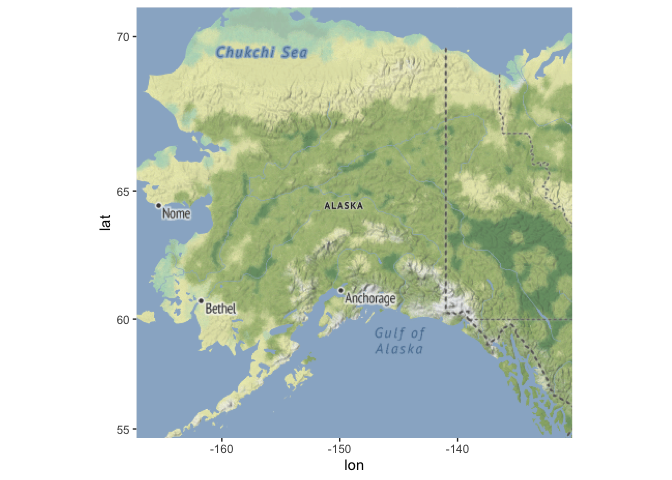
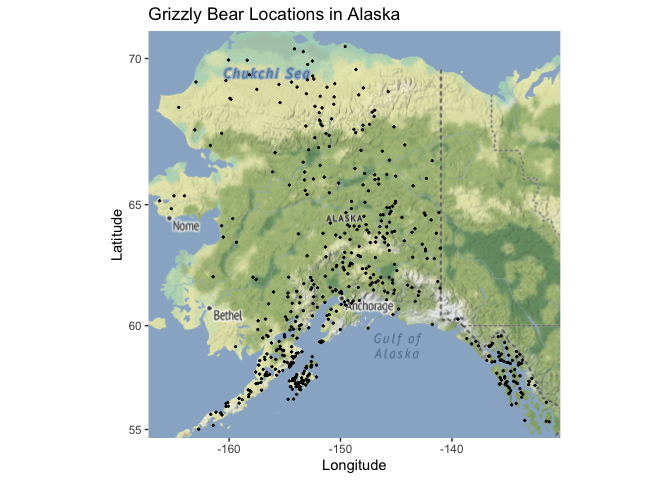
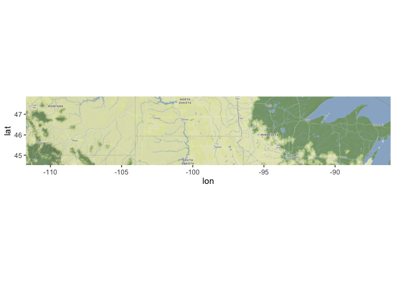
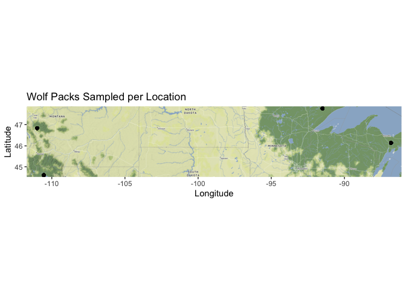
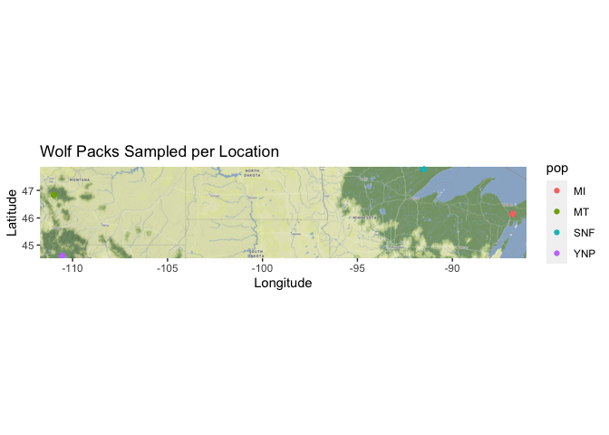

## Instructions
Answer the following questions and complete the exercises in RMarkdown. Please embed all of your code and push your final work to your repository. Your final lab report should be organized, clean, and run free from errors. Remember, you must remove the `#` for the included code chunks to run. Be sure to add your name to the author header above. For any included plots, make sure they are clearly labeled. You are free to use any plot type that you feel best communicates the results of your analysis.  

Make sure to use the formatting conventions of RMarkdown to make your report neat and clean!  

## Load the libraries  

```r
library(tidyverse)
library(janitor)
library(ggmap)
library(naniar)
```

## Load the Data
We will use two separate data sets for this homework.  

1. The first [data set](https://rcweb.dartmouth.edu/~f002d69/workshops/index_rspatial.html) represent sightings of grizzly bears (Ursos arctos) in Alaska.  

2. The second data set is from Brandell, Ellen E (2021), Serological dataset and R code for: Patterns and processes of pathogen exposure in gray wolves across North America, Dryad, [Dataset](https://doi.org/10.5061/dryad.5hqbzkh51).  

1. Load the `grizzly` data and evaluate its structure.  


```r
grizzly <- read_csv("data/bear-sightings.csv") %>% clean_names()
```

```
## Rows: 494 Columns: 3
## ── Column specification ────────────────────────────────────────────────────────
## Delimiter: ","
## dbl (3): bear.id, longitude, latitude
## 
## ℹ Use `spec()` to retrieve the full column specification for this data.
## ℹ Specify the column types or set `show_col_types = FALSE` to quiet this message.
```


```r
names(grizzly)
```

```
## [1] "bear_id"   "longitude" "latitude"
```


```r
glimpse(grizzly)
```

```
## Rows: 494
## Columns: 3
## $ bear_id   <dbl> 7, 57, 69, 75, 104, 108, 115, 116, 125, 135, 137, 162, 185, …
## $ longitude <dbl> -148.9560, -152.6228, -144.9374, -152.8485, -143.2948, -149.…
## $ latitude  <dbl> 62.65822, 58.35064, 62.38227, 59.90122, 61.07311, 62.91605, …
```

```r
miss_var_summary(grizzly)
```

```
## # A tibble: 3 × 3
##   variable  n_miss pct_miss
##   <chr>      <int>    <dbl>
## 1 bear_id        0        0
## 2 longitude      0        0
## 3 latitude       0        0
```

2. Use the range of the latitude and longitude to build an appropriate bounding box for your map. 

```r
summary(grizzly)
```

```
##     bear_id       longitude         latitude    
##  Min.   :   7   Min.   :-166.2   Min.   :55.02  
##  1st Qu.:2569   1st Qu.:-154.2   1st Qu.:58.13  
##  Median :4822   Median :-151.0   Median :60.97  
##  Mean   :4935   Mean   :-149.1   Mean   :61.41  
##  3rd Qu.:7387   3rd Qu.:-145.6   3rd Qu.:64.13  
##  Max.   :9996   Max.   :-131.3   Max.   :70.37
```

```r
lat <- c(55.02,70.37)
long <- c(-166.2,-131.3)
bbox1 <- make_bbox(long,lat,f=0.03)
```

3. Load a map from `stamen` in a terrain style projection and display the map. 


```r
#register_stadiamaps(, write = FALSE)
```


```r
map1 <- get_stadiamap(bbox1, maptype = "stamen_terrain", zoom=4)
```

```
## ℹ © Stadia Maps © Stamen Design © OpenMapTiles © OpenStreetMap contributors.
```


```r
ggmap(map1)
```

<!-- -->

4. Build a final map that overlays the recorded observations of grizzly bears in Alaska.  

```r
ggmap(map1) +
  geom_point(data = grizzly, aes(longitude, latitude),size=0.4)+
  labs(title = "Grizzly Bear Locations in Alaska",
       x="Longitude",
       y="Latitude")
```

<!-- -->

Let's switch to the wolves data. Brandell, Ellen E (2021), Serological dataset and R code for: Patterns and processes of pathogen exposure in gray wolves across North America, Dryad, [Dataset](https://doi.org/10.5061/dryad.5hqbzkh51).  

5. Load the data and evaluate its structure.  

```r
wolves <- read_csv("data/wolves_data/wolves_dataset.csv") %>% clean_names()
```

```
## Rows: 1986 Columns: 23
## ── Column specification ────────────────────────────────────────────────────────
## Delimiter: ","
## chr  (4): pop, age.cat, sex, color
## dbl (19): year, lat, long, habitat, human, pop.density, pack.size, standard....
## 
## ℹ Use `spec()` to retrieve the full column specification for this data.
## ℹ Specify the column types or set `show_col_types = FALSE` to quiet this message.
```

```r
wolves
```

```
## # A tibble: 1,986 × 23
##    pop     year age_cat sex   color   lat  long habitat human pop_density
##    <chr>  <dbl> <chr>   <chr> <chr> <dbl> <dbl>   <dbl> <dbl>       <dbl>
##  1 AK.PEN  2006 S       F     G      57.0 -158.    254.  10.4           8
##  2 AK.PEN  2006 S       M     G      57.0 -158.    254.  10.4           8
##  3 AK.PEN  2006 A       F     G      57.0 -158.    254.  10.4           8
##  4 AK.PEN  2006 S       M     B      57.0 -158.    254.  10.4           8
##  5 AK.PEN  2006 A       M     B      57.0 -158.    254.  10.4           8
##  6 AK.PEN  2006 A       M     G      57.0 -158.    254.  10.4           8
##  7 AK.PEN  2006 A       F     G      57.0 -158.    254.  10.4           8
##  8 AK.PEN  2006 P       M     G      57.0 -158.    254.  10.4           8
##  9 AK.PEN  2006 S       F     G      57.0 -158.    254.  10.4           8
## 10 AK.PEN  2006 P       M     G      57.0 -158.    254.  10.4           8
## # ℹ 1,976 more rows
## # ℹ 13 more variables: pack_size <dbl>, standard_habitat <dbl>,
## #   standard_human <dbl>, standard_pop <dbl>, standard_packsize <dbl>,
## #   standard_latitude <dbl>, standard_longitude <dbl>, cav_binary <dbl>,
## #   cdv_binary <dbl>, cpv_binary <dbl>, chv_binary <dbl>, neo_binary <dbl>,
## #   toxo_binary <dbl>
```


```r
names(wolves)
```

```
##  [1] "pop"                "year"               "age_cat"           
##  [4] "sex"                "color"              "lat"               
##  [7] "long"               "habitat"            "human"             
## [10] "pop_density"        "pack_size"          "standard_habitat"  
## [13] "standard_human"     "standard_pop"       "standard_packsize" 
## [16] "standard_latitude"  "standard_longitude" "cav_binary"        
## [19] "cdv_binary"         "cpv_binary"         "chv_binary"        
## [22] "neo_binary"         "toxo_binary"
```

```r
glimpse(wolves)
```

```
## Rows: 1,986
## Columns: 23
## $ pop                <chr> "AK.PEN", "AK.PEN", "AK.PEN", "AK.PEN", "AK.PEN", "…
## $ year               <dbl> 2006, 2006, 2006, 2006, 2006, 2006, 2006, 2006, 200…
## $ age_cat            <chr> "S", "S", "A", "S", "A", "A", "A", "P", "S", "P", "…
## $ sex                <chr> "F", "M", "F", "M", "M", "M", "F", "M", "F", "M", "…
## $ color              <chr> "G", "G", "G", "B", "B", "G", "G", "G", "G", "G", "…
## $ lat                <dbl> 57.03983, 57.03983, 57.03983, 57.03983, 57.03983, 5…
## $ long               <dbl> -157.8427, -157.8427, -157.8427, -157.8427, -157.84…
## $ habitat            <dbl> 254.08, 254.08, 254.08, 254.08, 254.08, 254.08, 254…
## $ human              <dbl> 10.42, 10.42, 10.42, 10.42, 10.42, 10.42, 10.42, 10…
## $ pop_density        <dbl> 8, 8, 8, 8, 8, 8, 8, 8, 8, 8, 8, 8, 8, 8, 8, 8, 8, …
## $ pack_size          <dbl> 8.78, 8.78, 8.78, 8.78, 8.78, 8.78, 8.78, 8.78, 8.7…
## $ standard_habitat   <dbl> -1.6339, -1.6339, -1.6339, -1.6339, -1.6339, -1.633…
## $ standard_human     <dbl> -0.9784, -0.9784, -0.9784, -0.9784, -0.9784, -0.978…
## $ standard_pop       <dbl> -0.6827, -0.6827, -0.6827, -0.6827, -0.6827, -0.682…
## $ standard_packsize  <dbl> 1.3157, 1.3157, 1.3157, 1.3157, 1.3157, 1.3157, 1.3…
## $ standard_latitude  <dbl> 0.7214, 0.7214, 0.7214, 0.7214, 0.7214, 0.7214, 0.7…
## $ standard_longitude <dbl> -2.1441, -2.1441, -2.1441, -2.1441, -2.1441, -2.144…
## $ cav_binary         <dbl> 1, 1, 1, 0, 1, 1, 1, 1, 1, 1, 1, 1, 1, 1, 1, 1, 1, …
## $ cdv_binary         <dbl> 0, 0, 0, 0, 0, 1, 0, 0, 0, 0, 0, 0, 0, 0, 0, 0, 0, …
## $ cpv_binary         <dbl> 0, 0, 1, 1, 0, 1, 0, 0, 0, 0, 1, 0, 0, 1, 0, 0, 0, …
## $ chv_binary         <dbl> 1, 1, 1, 1, 1, 1, 1, 1, 1, 0, 1, 1, 1, 1, 1, 1, 1, …
## $ neo_binary         <dbl> NA, NA, NA, 0, 0, NA, NA, 1, 0, 1, NA, 0, NA, NA, N…
## $ toxo_binary        <dbl> NA, NA, NA, 1, 0, NA, NA, 1, 0, 0, NA, 0, NA, NA, N…
```

```r
miss_var_summary(wolves)
```

```
## # A tibble: 23 × 3
##    variable    n_miss pct_miss
##    <chr>        <int>    <dbl>
##  1 toxo_binary    827   41.6  
##  2 color          616   31.0  
##  3 chv_binary     548   27.6  
##  4 neo_binary     538   27.1  
##  5 cav_binary     321   16.2  
##  6 age_cat        102    5.14 
##  7 cdv_binary      21    1.06 
##  8 sex             19    0.957
##  9 cpv_binary       7    0.352
## 10 pop              0    0    
## # ℹ 13 more rows
```

6. How many distinct wolf populations are included in this study? Make a new object that restricts the data to the wolf populations in the lower 48 US states. Note, the lower 48 states means we do not include Alaska and Hawaii

```r
lower48_wolves <- wolves %>% 
  filter(pop %in% c( "MT", "YNP", "GNTP","SNF", "MI"))
lower48_wolves
```

```
## # A tibble: 928 × 23
##    pop    year age_cat sex   color   lat  long habitat human pop_density
##    <chr> <dbl> <chr>   <chr> <chr> <dbl> <dbl>   <dbl> <dbl>       <dbl>
##  1 MI     2004 S       F     <NA>   46.1 -86.8   9511. 6229.        23.0
##  2 MI     2008 A       F     <NA>   46.1 -86.8   9511. 6229.        23.0
##  3 MI     2008 A       F     <NA>   46.1 -86.8   9511. 6229.        23.0
##  4 MI     2008 A       F     <NA>   46.1 -86.8   9511. 6229.        23.0
##  5 MI     2008 <NA>    <NA>  <NA>   46.1 -86.8   9511. 6229.        23.0
##  6 MI     2008 P       M     <NA>   46.1 -86.8   9511. 6229.        23.0
##  7 MI     2008 A       F     <NA>   46.1 -86.8   9511. 6229.        23.0
##  8 MI     2008 A       M     <NA>   46.1 -86.8   9511. 6229.        23.0
##  9 MI     2009 A       M     <NA>   46.1 -86.8   9511. 6229.        23.0
## 10 MI     2009 A       F     <NA>   46.1 -86.8   9511. 6229.        23.0
## # ℹ 918 more rows
## # ℹ 13 more variables: pack_size <dbl>, standard_habitat <dbl>,
## #   standard_human <dbl>, standard_pop <dbl>, standard_packsize <dbl>,
## #   standard_latitude <dbl>, standard_longitude <dbl>, cav_binary <dbl>,
## #   cdv_binary <dbl>, cpv_binary <dbl>, chv_binary <dbl>, neo_binary <dbl>,
## #   toxo_binary <dbl>
```


```r
lower48_wolves %>% 
  count(pop) %>% 
  mutate(total_pop=n_distinct(pop))
```

```
## # A tibble: 4 × 3
##   pop       n total_pop
##   <chr> <int>     <int>
## 1 MI      102         4
## 2 MT      351         4
## 3 SNF      92         4
## 4 YNP     383         4
```
Within the lower 48 states, we have 4 distinct wolf populations

7. Use the range of the latitude and longitude to build an appropriate bounding box for your map. 

```r
summary(lower48_wolves)
```

```
##      pop                 year        age_cat              sex           
##  Length:928         Min.   :1997   Length:928         Length:928        
##  Class :character   1st Qu.:2006   Class :character   Class :character  
##  Mode  :character   Median :2010   Mode  :character   Mode  :character  
##                     Mean   :2009                                        
##                     3rd Qu.:2013                                        
##                     Max.   :2019                                        
##                                                                         
##     color                lat             long            habitat     
##  Length:928         Min.   :44.60   Min.   :-110.99   Min.   : 9511  
##  Class :character   1st Qu.:44.60   1st Qu.:-110.99   1st Qu.:11166  
##  Mode  :character   Median :46.15   Median :-110.55   Median :11211  
##                     Mean   :45.93   Mean   :-106.22   Mean   :13070  
##                     3rd Qu.:46.83   3rd Qu.:-110.55   3rd Qu.:11211  
##                     Max.   :47.75   Max.   : -86.82   Max.   :32018  
##                                                                      
##      human       pop_density      pack_size    standard_habitat  
##  Min.   :3240   Min.   :11.63   Min.   :4.81   Min.   :-0.41960  
##  1st Qu.:3240   1st Qu.:11.63   1st Qu.:5.62   1st Qu.:-0.20240  
##  Median :3973   Median :25.32   Median :7.12   Median :-0.19650  
##  Mean   :4002   Mean   :21.38   Mean   :6.79   Mean   : 0.04735  
##  3rd Qu.:3973   3rd Qu.:28.93   3rd Qu.:8.25   3rd Qu.:-0.19650  
##  Max.   :6229   Max.   :28.93   Max.   :8.25   Max.   : 2.53310  
##                                                                  
##  standard_human    standard_pop     standard_packsize standard_latitude
##  Min.   :0.5834   Min.   :-0.2976   Min.   :-1.0179   Min.   :-0.6369  
##  1st Qu.:0.5834   1st Qu.:-0.2976   1st Qu.:-0.5418   1st Qu.:-0.6369  
##  Median :0.9383   Median : 1.1548   Median : 0.3399   Median :-0.4677  
##  Mean   :0.9520   Mean   : 0.7368   Mean   : 0.1459   Mean   :-0.4918  
##  3rd Qu.:0.9383   3rd Qu.: 1.5378   3rd Qu.: 1.0041   3rd Qu.:-0.3926  
##  Max.   :2.0290   Max.   : 1.5378   Max.   : 1.0041   Max.   :-0.2927  
##                                                                        
##  standard_longitude   cav_binary       cdv_binary       cpv_binary    
##  Min.   :0.3069     Min.   :0.0000   Min.   :0.0000   Min.   :0.0000  
##  1st Qu.:0.3069     1st Qu.:1.0000   1st Qu.:0.0000   1st Qu.:1.0000  
##  Median :0.3302     Median :1.0000   Median :0.0000   Median :1.0000  
##  Mean   :0.5566     Mean   :0.8298   Mean   :0.2678   Mean   :0.8864  
##  3rd Qu.:0.3302     3rd Qu.:1.0000   3rd Qu.:1.0000   3rd Qu.:1.0000  
##  Max.   :1.5716     Max.   :1.0000   Max.   :1.0000   Max.   :1.0000  
##                     NA's   :41       NA's   :2        NA's   :4       
##    chv_binary       neo_binary     toxo_binary    
##  Min.   :0.0000   Min.   :0.000   Min.   :0.0000  
##  1st Qu.:1.0000   1st Qu.:0.000   1st Qu.:0.0000  
##  Median :1.0000   Median :0.000   Median :0.0000  
##  Mean   :0.7799   Mean   :0.362   Mean   :0.4769  
##  3rd Qu.:1.0000   3rd Qu.:1.000   3rd Qu.:1.0000  
##  Max.   :1.0000   Max.   :1.000   Max.   :1.0000  
##  NA's   :201      NA's   :207     NA's   :496
```


```r
lat <- c(44.60,47.75)
long <- c(-110.99,-86.82)
bbox2 <- make_bbox(long,lat, f=0.03)
```

8.  Load a map from `stamen` in a `terrain-lines` projection and display the map.  

```r
map2 <- get_stadiamap(bbox2, maptype = "stamen_terrain", zoom=7)
```

```
## ℹ © Stadia Maps © Stamen Design © OpenMapTiles © OpenStreetMap contributors.
```


```r
ggmap(map2)
```

<!-- -->

9. Build a final map that overlays the recorded observations of wolves in the lower 48 states.  

```r
ggmap(map2)+
  geom_point(data=lower48_wolves,aes(long,lat))+
  labs(title = "Wolf Packs Sampled per Location",
       x="Longitude",
       y="Latitude")
```

<!-- -->

10. Use the map from #9 above, but add some aesthetics. Try to `fill` and `color` by population.  

```r
ggmap(map2)+
  geom_point(data=lower48_wolves,aes(long,lat,color=pop))+
  labs(title = "Wolf Packs Sampled per Location",
       x="Longitude",
       y="Latitude")
```

<!-- -->

## Push your final code to GitHub!
Please be sure that you check the `keep md` file in the knit preferences. 
