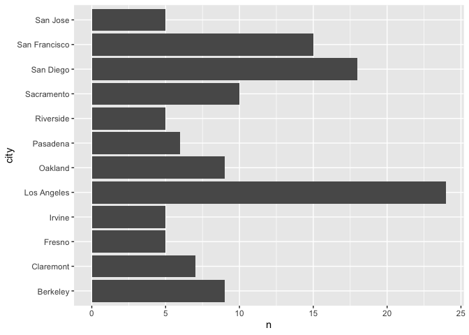
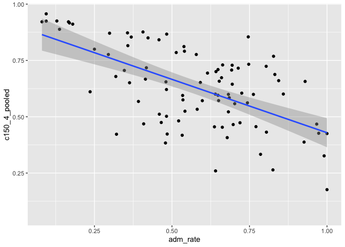

## Instructions
Answer the following questions and complete the exercises in RMarkdown. Please embed all of your code and push your final work to your repository. Your final lab report should be organized, clean, and run free from errors. Remember, you must remove the `#` for the included code chunks to run. Be sure to add your name to the author header above.  

Make sure to use the formatting conventions of RMarkdown to make your report neat and clean!  

## Load the libraries

```r
library(tidyverse)
library(janitor)
library(here)
library(naniar)
```

For this homework, we will take a departure from biological data and use data about California colleges. These data are a subset of the national college scorecard (https://collegescorecard.ed.gov/data/). Load the `ca_college_data.csv` as a new object called `colleges`.

```r
colleges <- read_csv("data/ca_college_data.csv") %>% clean_names()
```

```
## Rows: 341 Columns: 10
## ── Column specification ────────────────────────────────────────────────────────
## Delimiter: ","
## chr (4): INSTNM, CITY, STABBR, ZIP
## dbl (6): ADM_RATE, SAT_AVG, PCIP26, COSTT4_A, C150_4_POOLED, PFTFTUG1_EF
## 
## ℹ Use `spec()` to retrieve the full column specification for this data.
## ℹ Specify the column types or set `show_col_types = FALSE` to quiet this message.
```

The variables are a bit hard to decipher, here is a key:  

INSTNM: Institution name  
CITY: California city  
STABBR: Location state  
ZIP: Zip code  
ADM_RATE: Admission rate  
SAT_AVG: SAT average score  
PCIP26: Percentage of degrees awarded in Biological And Biomedical Sciences  
COSTT4_A: Annual cost of attendance  
C150_4_POOLED: 4-year completion rate  
PFTFTUG1_EF: Percentage of undergraduate students who are first-time, full-time degree/certificate-seeking undergraduate students  

1. Use your preferred function(s) to have a look at the data and get an idea of its structure. Make sure you summarize NA's and determine whether or not the data are tidy. You may also consider dealing with any naming issues.


```r
names(colleges)
```

```
##  [1] "instnm"        "city"          "stabbr"        "zip"          
##  [5] "adm_rate"      "sat_avg"       "pcip26"        "costt4_a"     
##  [9] "c150_4_pooled" "pftftug1_ef"
```


```r
str(colleges)
```

```
## spc_tbl_ [341 × 10] (S3: spec_tbl_df/tbl_df/tbl/data.frame)
##  $ instnm       : chr [1:341] "Grossmont College" "College of the Sequoias" "College of San Mateo" "Ventura College" ...
##  $ city         : chr [1:341] "El Cajon" "Visalia" "San Mateo" "Ventura" ...
##  $ stabbr       : chr [1:341] "CA" "CA" "CA" "CA" ...
##  $ zip          : chr [1:341] "92020-1799" "93277-2214" "94402-3784" "93003-3872" ...
##  $ adm_rate     : num [1:341] NA NA NA NA NA NA NA NA NA NA ...
##  $ sat_avg      : num [1:341] NA NA NA NA NA NA NA NA NA NA ...
##  $ pcip26       : num [1:341] 0.0016 0.0066 0.0038 0.0035 0.0085 0.0151 0 0.002 0.0021 0.0324 ...
##  $ costt4_a     : num [1:341] 7956 8109 8278 8407 8516 ...
##  $ c150_4_pooled: num [1:341] NA NA NA NA NA ...
##  $ pftftug1_ef  : num [1:341] 0.355 0.541 0.357 0.382 0.275 ...
##  - attr(*, "spec")=
##   .. cols(
##   ..   INSTNM = col_character(),
##   ..   CITY = col_character(),
##   ..   STABBR = col_character(),
##   ..   ZIP = col_character(),
##   ..   ADM_RATE = col_double(),
##   ..   SAT_AVG = col_double(),
##   ..   PCIP26 = col_double(),
##   ..   COSTT4_A = col_double(),
##   ..   C150_4_POOLED = col_double(),
##   ..   PFTFTUG1_EF = col_double()
##   .. )
##  - attr(*, "problems")=<externalptr>
```

```r
colleges
```

```
## # A tibble: 341 × 10
##    instnm      city  stabbr zip   adm_rate sat_avg pcip26 costt4_a c150_4_pooled
##    <chr>       <chr> <chr>  <chr>    <dbl>   <dbl>  <dbl>    <dbl>         <dbl>
##  1 Grossmont … El C… CA     9202…       NA      NA 0.0016     7956        NA    
##  2 College of… Visa… CA     9327…       NA      NA 0.0066     8109        NA    
##  3 College of… San … CA     9440…       NA      NA 0.0038     8278        NA    
##  4 Ventura Co… Vent… CA     9300…       NA      NA 0.0035     8407        NA    
##  5 Oxnard Col… Oxna… CA     9303…       NA      NA 0.0085     8516        NA    
##  6 Moorpark C… Moor… CA     9302…       NA      NA 0.0151     8577        NA    
##  7 Skyline Co… San … CA     9406…       NA      NA 0          8580         0.233
##  8 Glendale C… Glen… CA     9120…       NA      NA 0.002      9181        NA    
##  9 Citrus Col… Glen… CA     9174…       NA      NA 0.0021     9281        NA    
## 10 Fresno Cit… Fres… CA     93741       NA      NA 0.0324     9370        NA    
## # ℹ 331 more rows
## # ℹ 1 more variable: pftftug1_ef <dbl>
```
Note that the colleges included in this data set are all in CA.  This data does appear to be tidy as each column name is not representative of specific data and each row/observation is unique. 


```r
miss_var_summary(colleges)
```

```
## # A tibble: 10 × 3
##    variable      n_miss pct_miss
##    <chr>          <int>    <dbl>
##  1 sat_avg          276     80.9
##  2 adm_rate         240     70.4
##  3 c150_4_pooled    221     64.8
##  4 costt4_a         124     36.4
##  5 pftftug1_ef       53     15.5
##  6 pcip26            35     10.3
##  7 instnm             0      0  
##  8 city               0      0  
##  9 stabbr             0      0  
## 10 zip                0      0
```


```r
sum(is.na(colleges))
```

```
## [1] 949
```

We have 949 NAs in the `colleges` data. 

2. Which cities in California have the highest number of colleges?

```r
colleges %>% 
  select(city,stabbr,instnm) %>% 
  filter(stabbr=="CA") %>% 
  group_by(city) %>% 
  summarise(n_colleges=n_distinct(instnm)) %>% 
  arrange(desc(n_colleges))
```

```
## # A tibble: 159 × 2
##    city          n_colleges
##    <chr>              <int>
##  1 Los Angeles           24
##  2 San Diego             18
##  3 San Francisco         15
##  4 Sacramento            10
##  5 Berkeley               9
##  6 Oakland                9
##  7 Claremont              7
##  8 Pasadena               6
##  9 Fresno                 5
## 10 Irvine                 5
## # ℹ 149 more rows
```
LA has the highest number of distinct colleges at 24 counts. 

3. Based on your answer to #2, make a plot that shows the number of colleges in the top 10 cities.

```r
colleges %>% 
  count(city) %>% 
  top_n(10,n) %>% 
  ggplot(aes(y=city, x=n))+
  geom_col()
```

<!-- -->
Putting the cities on the y-axis (instead of the x-axis) makes it easier to read the different city names. 

4. The column `COSTT4_A` is the annual cost of each institution. Which city has the highest average cost? Where is it located?

```r
colleges %>%
  group_by(city,instnm) %>% 
  summarise(mean_cost=mean(costt4_a,na.rm=T)) %>% 
  arrange(desc(mean_cost))
```

```
## `summarise()` has grouped output by 'city'. You can override using the
## `.groups` argument.
```

```
## # A tibble: 341 × 3
## # Groups:   city [161]
##    city          instnm                                        mean_cost
##    <chr>         <chr>                                             <dbl>
##  1 Claremont     Harvey Mudd College                               69355
##  2 Los Angeles   Southern California Institute of Architecture     67225
##  3 Los Angeles   University of Southern California                 67064
##  4 Los Angeles   Occidental College                                67046
##  5 Claremont     Claremont McKenna College                         66325
##  6 Malibu        Pepperdine University                             66152
##  7 Claremont     Scripps College                                   66060
##  8 Claremont     Pitzer College                                    65880
##  9 San Francisco San Francisco Art Institute                       65453
## 10 Claremont     Pomona College                                    64870
## # ℹ 331 more rows
```
The Harvey Mudd College located in Claremont city had the highest mean annual cost of attendance at 69355. This city is located in CA. 

5. Based on your answer to #4, make a plot that compares the cost of the individual colleges in the most expensive city. Bonus! Add UC Davis here to see how it compares :>).

Code alone: 

```r
colleges %>% 
  filter(city=="Claremont") %>% 
  group_by(city, instnm) %>% 
  summarise(total_cost=sum(costt4_a,rm.na=T)) %>% 
  arrange(desc(total_cost)) 
```

```
## `summarise()` has grouped output by 'city'. You can override using the
## `.groups` argument.
```

```
## # A tibble: 7 × 3
## # Groups:   city [1]
##   city      instnm                        total_cost
##   <chr>     <chr>                              <dbl>
## 1 Claremont Harvey Mudd College                69356
## 2 Claremont Claremont McKenna College          66326
## 3 Claremont Scripps College                    66061
## 4 Claremont Pitzer College                     65881
## 5 Claremont Pomona College                     64871
## 6 Claremont Claremont Graduate University         NA
## 7 Claremont Claremont School of Theology          NA
```
Resulting plot (and adding UCD): 

```r
colleges %>% 
  filter(city=="Claremont" | city=="Davis") %>% 
  group_by(city, instnm) %>% 
  summarise(total_cost=sum(costt4_a,rm.na=T)) %>% 
  arrange(desc(total_cost)) %>% 
  ggplot(aes(y=instnm,x=total_cost))+
  geom_col()
```

```
## `summarise()` has grouped output by 'city'. You can override using the
## `.groups` argument.
```

```
## Warning: Removed 2 rows containing missing values (`position_stack()`).
```

<!-- -->

6. The column `ADM_RATE` is the admissions rate by college and `C150_4_POOLED` is the four-year completion rate. Use a scatterplot to show the relationship between these two variables. What do you think this means?

```r
colleges %>% 
  ggplot(aes(x=adm_rate,y=c150_4_pooled))+
  geom_point()+
  geom_smooth(method = lm,se=T)
```

```
## `geom_smooth()` using formula = 'y ~ x'
```

```
## Warning: Removed 251 rows containing non-finite values (`stat_smooth()`).
```

```
## Warning: Removed 251 rows containing missing values (`geom_point()`).
```

<!-- -->
In the plot shown above, we see there is a negative relationship between college admission rate and 4 year completion rate. The higher the admission rate, the lower the overall 4 year completion rate. On the other hand, the lower the admission rate, the higher the 4 year completion rate. 


7. Is there a relationship between cost and four-year completion rate? (You don't need to do the stats, just produce a plot). What do you think this means?

```r
colleges %>% 
  ggplot(aes(x=adm_rate,y=costt4_a))+
  geom_point()+
  geom_smooth(method = lm,se=T)
```

```
## `geom_smooth()` using formula = 'y ~ x'
```

```
## Warning: Removed 249 rows containing non-finite values (`stat_smooth()`).
```

```
## Warning: Removed 249 rows containing missing values (`geom_point()`).
```

<!-- -->
No, there does not seem to be a relationship between admission rate and cost of attendance. As shown in the plot above, the data points between these axis are highly variable with no clear increasing or decreasing trend. 

8. The column titled `INSTNM` is the institution name. We are only interested in the University of California colleges. Make a new data frame that is restricted to UC institutions. You can remove `Hastings College of Law` and `UC San Francisco` as we are only interested in undergraduate institutions.

```r
uc_colleges <- colleges %>% 
  select(instnm,city,stabbr,zip,adm_rate,sat_avg,pcip26,costt4_a,c150_4_pooled,pftftug1_ef) %>% 
  filter(instnm=="University of California-San Diego" | instnm=="University of California-Irvine" | instnm== "University of California-Riverside" | instnm== "University of California-Los Angeles" | instnm =="University of California-Davis" | instnm=="University of California-Santa Cruz" |instnm== "University of California-Santa Barbara" | instnm== "University of California-Berkeley")
uc_colleges
```

```
## # A tibble: 8 × 10
##   instnm       city  stabbr zip   adm_rate sat_avg pcip26 costt4_a c150_4_pooled
##   <chr>        <chr> <chr>  <chr>    <dbl>   <dbl>  <dbl>    <dbl>         <dbl>
## 1 University … La J… CA     92093    0.357    1324  0.216    31043         0.872
## 2 University … Irvi… CA     92697    0.406    1206  0.107    31198         0.876
## 3 University … Rive… CA     92521    0.663    1078  0.149    31494         0.73 
## 4 University … Los … CA     9009…    0.180    1334  0.155    33078         0.911
## 5 University … Davis CA     9561…    0.423    1218  0.198    33904         0.850
## 6 University … Sant… CA     9506…    0.578    1201  0.193    34608         0.776
## 7 University … Berk… CA     94720    0.169    1422  0.105    34924         0.916
## 8 University … Sant… CA     93106    0.358    1281  0.108    34998         0.816
## # ℹ 1 more variable: pftftug1_ef <dbl>
```

Remove `Hastings College of Law` and `UC San Francisco` and store the final data frame as a new object `univ_calif_final`.

```r
univ_calif_final<- uc_colleges 
```
Since I manually selected which colleges to include in the filter function, the `Hastings College of Law` and `UC San Francisco` colleges are not included, and hence do not to be removed from the pre-existing `uc_colleges` object. 

Use `separate()` to separate institution name into two new columns "UNIV" and "CAMPUS".

```r
univ_calif_final %>% 
  separate(instnm,into = c("univ","campus"),sep="-")
```

```
## # A tibble: 8 × 11
##   univ  campus city  stabbr zip   adm_rate sat_avg pcip26 costt4_a c150_4_pooled
##   <chr> <chr>  <chr> <chr>  <chr>    <dbl>   <dbl>  <dbl>    <dbl>         <dbl>
## 1 Univ… San D… La J… CA     92093    0.357    1324  0.216    31043         0.872
## 2 Univ… Irvine Irvi… CA     92697    0.406    1206  0.107    31198         0.876
## 3 Univ… River… Rive… CA     92521    0.663    1078  0.149    31494         0.73 
## 4 Univ… Los A… Los … CA     9009…    0.180    1334  0.155    33078         0.911
## 5 Univ… Davis  Davis CA     9561…    0.423    1218  0.198    33904         0.850
## 6 Univ… Santa… Sant… CA     9506…    0.578    1201  0.193    34608         0.776
## 7 Univ… Berke… Berk… CA     94720    0.169    1422  0.105    34924         0.916
## 8 Univ… Santa… Sant… CA     93106    0.358    1281  0.108    34998         0.816
## # ℹ 1 more variable: pftftug1_ef <dbl>
```

9. The column `ADM_RATE` is the admissions rate by campus. Which UC has the lowest and highest admissions rates? Produce a numerical summary and an appropriate plot.

```r
univ_calif_final %>% 
  separate(instnm,into = c("univ","campus"),sep="-") %>% 
  group_by(campus) %>% 
  summarise(total_admission=sum(adm_rate)) %>% 
  arrange(desc(total_admission))
```

```
## # A tibble: 8 × 2
##   campus        total_admission
##   <chr>                   <dbl>
## 1 Riverside               0.663
## 2 Santa Cruz              0.578
## 3 Davis                   0.423
## 4 Irvine                  0.406
## 5 Santa Barbara           0.358
## 6 San Diego               0.357
## 7 Los Angeles             0.180
## 8 Berkeley                0.169
```
From the numerical summary shown above, the campus with the highest admission rate is UC Riverside, and the campus with the lowest admission rate is UC Berkeley. 


```r
univ_calif_final %>% 
  separate(instnm,into = c("univ","campus"),sep="-") %>% 
  group_by(campus) %>% 
  summarise(total_admission=sum(adm_rate)) %>% 
  arrange(desc(total_admission)) %>% 
  ggplot(aes(y=campus,x=total_admission)) +
  geom_col()
```

<!-- -->

10. If you wanted to get a degree in biological or biomedical sciences, which campus confers the majority of these degrees? Produce a numerical summary and an appropriate plot. (Using the PCIP26 vairable)

```r
univ_calif_final %>% 
  separate(instnm,into = c("univ","campus"),sep="-") %>% 
  group_by(campus) %>% 
  summarise(total_bio_degrees=sum(pcip26)) %>% 
  arrange(desc(total_bio_degrees))
```

```
## # A tibble: 8 × 2
##   campus        total_bio_degrees
##   <chr>                     <dbl>
## 1 San Diego                 0.216
## 2 Davis                     0.198
## 3 Santa Cruz                0.193
## 4 Los Angeles               0.155
## 5 Riverside                 0.149
## 6 Santa Barbara             0.108
## 7 Irvine                    0.107
## 8 Berkeley                  0.105
```
From the numerical summary above, we see that UC San Diego, of all the UC schools, has the highest majority of biological or biomedical science degrees. 


```r
univ_calif_final %>% 
  separate(instnm,into = c("univ","campus"),sep="-") %>% 
  group_by(campus) %>% 
  summarise(total_bio_degrees=sum(pcip26)) %>% 
  ggplot(aes(y=campus,x=total_bio_degrees))+
  geom_col()
```

<!-- -->

## Knit Your Output and Post to [GitHub](https://github.com/FRS417-DataScienceBiologists)
