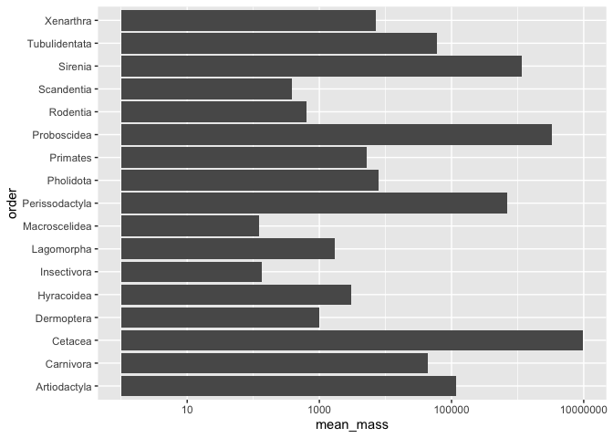
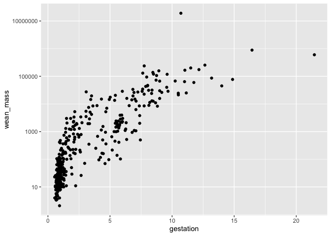

## Learning Goals
*At the end of this exercise, you will be able to:*    
1. Produce box plots using `ggplot.`  
2. Customize labels on axes using `labs` and `themes`.  
3. Use `color`, `fill`, and `group` to customize plots and improve aesthetics.  

## Review
Now that you have been introduced to `ggplot`, let's review the plot types from last week and learn how to manipulate their aesthetics to better suit our needs. Aesthetics make a significant visual difference, but you can take it too far so remember that the goal is to produce clean plots that are not distracting.  

## Resources
- [ggplot2 cheatsheet](https://www.rstudio.com/wp-content/uploads/2015/03/ggplot2-cheatsheet.pdf)
- [`ggplot` themes](https://ggplot2.tidyverse.org/reference/ggtheme.html)
- [Rebecca Barter `ggplot` Tutorial](http://www.rebeccabarter.com/blog/2017-11-17-ggplot2_tutorial/)

## Load the libraries

```r
library("tidyverse")
library("janitor")
```

## Load the data
Let's revisit the mammal life history data to practice our ggplot skills. The [data](http://esapubs.org/archive/ecol/E084/093/) are from: *S. K. Morgan Ernest. 2003. Life history characteristics of placental non-volant mammals. Ecology 84:3402.*

```r
life_history <- read_csv("data/mammal_lifehistories_v2.csv", na="-999") %>% clean_names()
```

## Bar Plots
Bar plots count the number of observations in a categorical variable. What is the difference between `geom_bar` and `geom_col`? Make two bar plots showing the number of observations for each order using each geom type.

```r
names(life_history)
```

```
##  [1] "order"        "family"       "genus"        "species"      "mass"        
##  [6] "gestation"    "newborn"      "weaning"      "wean_mass"    "afr"         
## [11] "max_life"     "litter_size"  "litters_year"
```


`geom_col` Allows us to specify thex and y variables. using the count function to specify the x and y variables 

```r
life_history %>% 
  count(order, sort=T) %>%  #this code line is the same as arrange to organize the data 
  ggplot(aes(x=order,y=n))+
  geom_col()+
  coord_flip()
```

<!-- -->

`geom_bar`
y is by default a count (counting the number of unique observations from the variable we specify)
x is the categorical variable we wish to get more information from 

```r
life_history %>% 
  ggplot(aes(x=order))+
  geom_bar()+
  coord_flip()
```

<!-- -->

Remember that ggplot build plots in layers. These layers can significantly improve the appearance of the plot. What if we wanted a bar plot of the mean mass for each order? Would we use `geom_bar` or `geom_col`?  

By default the gglot function goes in the order of x and y for the axis labeling 


```r
life_history %>% 
  group_by(order) %>% 
  summarise(mean_mass=mean(mass,na.rm = T)) %>% 
  ggplot(aes(x=order,y=mean_mass))+
  geom_col()+
  coord_flip()
```

<!-- -->

There are a few problems here. First, the y-axis is in scientific notation. We can fix this by adjusting the options for the session.

Even when we fix the scientific notation, note that the huge range in mean mass makes us unable to see the smaller groups of data 

```r
options(scipen=999)#cancels scientific notation for the session
```

Next, the y-axis is not on a log scale. We can fix this by adding `scale_y_log10()`.

```r
life_history %>% 
  group_by(order) %>% 
  summarise(mean_mass=mean(mass,na.rm = T)) %>% 
  ggplot(aes(x=order,y=mean_mass))+
  geom_col()+
  coord_flip()+
  scale_y_log10()
```

<!-- -->
By adding the log10 adjustments we can scale the mean values so we can see both the smaller and larger plot values. Used to improve the communication and aesthetics of the plots we produce. 

Lastly, we can adjust the x-axis labels to make them more readable. We do this using `reorder`. This gets the small values on one side of the plot and large values on the other side. 

```r
life_history %>% 
  group_by(order) %>% 
  summarise(mean_mass=mean(mass,na.rm = T)) %>% 
  ggplot(aes(x=reorder(order,mean_mass),y=mean_mass))+ #the reorder function here allows us to reorder the x-axis by mean_mass, in terms of small to big (and vise versa)
  geom_col()+ 
  coord_flip()+
  scale_y_log10()
```

<!-- -->

## Scatterplots
Scatter plots allow for comparisons of two continuous variables. Make a scatterplot below that compares gestation time and weaning mass.


```r
names(life_history)
```

```
##  [1] "order"        "family"       "genus"        "species"      "mass"        
##  [6] "gestation"    "newborn"      "weaning"      "wean_mass"    "afr"         
## [11] "max_life"     "litter_size"  "litters_year"
```


```r
life_history %>% 
  ggplot(aes(x=gestation, y=wean_mass))+
  geom_jitter(na.rm=T)+ #prevents overplotting
  scale_y_log10()
```

<!-- -->
Jitter introduces random noise to prevent overplotting. Using the log scale makes it easier to read largely contrasting data ranges 

## Boxplots
Box plots help us visualize a range of values. So, on the x-axis we typically have something categorical and the y-axis is the range. Let's make a box plot that compares mass across taxonomic orders.

```r
life_history %>% 
  ggplot(aes(x=order,y=mass))+
  geom_boxplot(na.rm=T)+
  coord_flip()
```

<!-- -->


```r
life_history %>% 
  ggplot(aes(x=order,y=mass))+
  geom_boxplot(na.rm=T)+
  coord_flip()+
  scale_y_log10()
```

<!-- -->
Box plots are making quartiles. 

## Aesthetics: Labels
Now that we have practiced scatter plots, bar plots, and box plots we need to learn how to adjust their appearance to suit our needs. Let's start with labeling x and y axes.  

For this exercise, let's use the `ElephantsMF` data. These data are from Phyllis Lee, Stirling University, and are related to Lee, P., et al. (2013), "Enduring consequences of early experiences: 40-year effects on survival and success among African elephants (Loxodonta africana)," Biology Letters, 9: 20130011. [kaggle](https://www.kaggle.com/mostafaelseidy/elephantsmf).

```r
elephants <- read_csv("data/elephantsMF.csv") %>% clean_names()
```

```
## Rows: 288 Columns: 3
## ── Column specification ────────────────────────────────────────────────────────
## Delimiter: ","
## chr (1): Sex
## dbl (2): Age, Height
## 
## ℹ Use `spec()` to retrieve the full column specification for this data.
## ℹ Specify the column types or set `show_col_types = FALSE` to quiet this message.
```

Make a plot that compares age and height of elephants.

```r
elephants %>% 
  ggplot(aes(x=age,y=height))+
  geom_jitter()+ #scatter since 2 cont. variables
  geom_smooth(method=lm, se=F)
```

```
## `geom_smooth()` using formula = 'y ~ x'
```

<!-- -->
Using a column plot here was not very informative, to many data to see a clear trend. Plus, we have 2 continous vairables. Need to be able to determine what plot to use based on the variables we wish to plot. 

se stands for `standard error` 

The plot looks clean, but it is incomplete. A reader unfamiliar with the data might have a difficult time interpreting the labels. To add custom labels, we use the `labs` command.

```r
elephants %>% 
  ggplot(aes(x=age, y=height)) + 
  geom_point() + 
  geom_smooth(method=lm, se=F)+
  labs(title="Elephant Age vs. Height", #adds a title based on what we want the axis to be called 
       x="Age (years)", 
       y="Height (cm)")
```

```
## `geom_smooth()` using formula = 'y ~ x'
```

<!-- -->

We can improve the plot further by adjusting the size and face of the text. We do this using `theme()`. The `rel()` option changes the relative size of the title to keep things consistent. Adding `hjust` allows control of title position.

```r
elephants %>% 
  ggplot(aes(x=age, y=height)) + 
  geom_point() + 
  geom_smooth(method=lm, se=F)+
  labs(title="Elephant Age vs. Height", #adds a title based on what we want the axis to be called 
       x="Age (years)", 
       y="Height (cm)")+
  theme(plot.title = element_text(size = rel(1.5),hjust = 0.5))
```

```
## `geom_smooth()` using formula = 'y ~ x'
```

<!-- -->

rel is relative (the title is whatever number larger than the x and y titles)
hjust is horizontal justification (the larger the number, the more to the right this title is going to move)
using methods give the logistic curve of best fit 
using method gives a linear curve of best fit 

## Other Aesthetics
There are lots of options for aesthetics. An aesthetic can be assigned to either numeric or categorical data. `fill` is a common grouping option; notice that an appropriate key is displayed when you use one of these options.

```r
elephants %>% 
  ggplot(aes(x=sex, fill=sex))+ #fill is a grouping option
  geom_bar()
```

<!-- -->
Using R defaults colors to color in the bars by sex. Fill is the grouping function 

`size` adjusts the size of points relative to a continuous variable.

```r
life_history %>% 
  ggplot(aes(x=gestation, y=log10(mass), size=mass))+
  geom_point(na.rm=T)
```

<!-- -->
Plotted gestation vs mass with the log10 scale incorporated with the ggplot function. Size of the point reflects the size of the point being plotted 

## That's it! Let's take a break and then move on to part 2!  

-->[Home](https://jmledford3115.github.io/datascibiol/)
