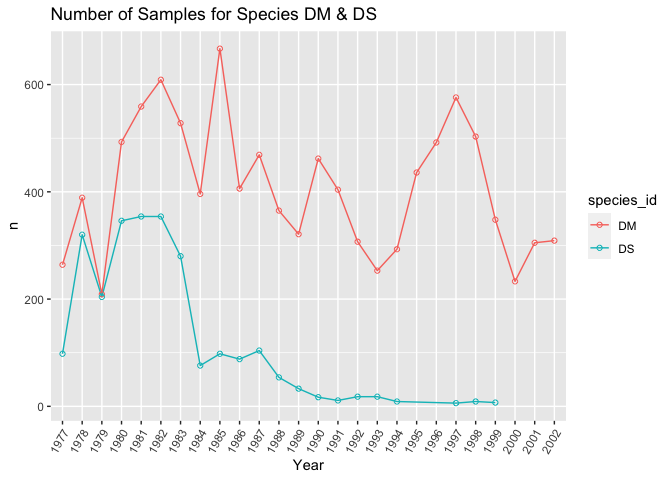
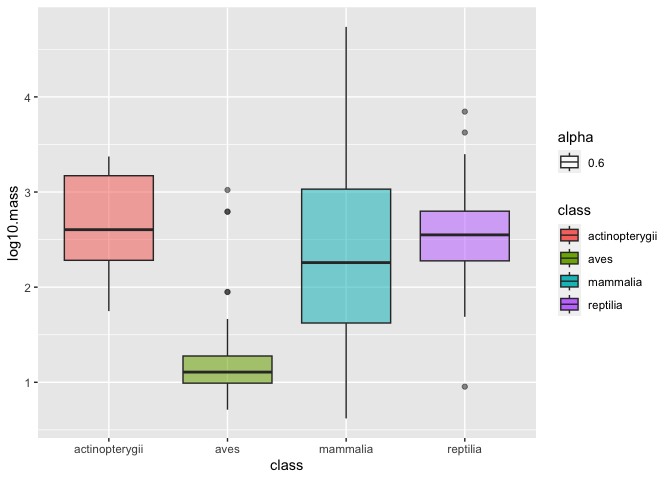

## Learning Goals
*At the end of this exercise, you will be able to:*    
1. Build histograms and density plots.
2. Adjust colors using R's built-in color options.  
3. Create new categories with `case_when()` and use those categories to build plots.  
4. Build line plots.  

## Resources
- [ggplot2 cheatsheet](https://www.rstudio.com/wp-content/uploads/2015/03/ggplot2-cheatsheet.pdf)
- [R for Data Science](https://r4ds.had.co.nz/)
- [R Cookbook](http://www.cookbook-r.com/)
- [`ggplot` themes](https://ggplot2.tidyverse.org/reference/ggtheme.html)
- [Rebecca Barter `ggplot` Tutorial](http://www.rebeccabarter.com/blog/2017-11-17-ggplot2_tutorial/)
- [R Color Brewer](http://colorbrewer2.org/#type=sequential&scheme=BuGn&n=3)

## Install `RColorBrewer`, `paletteer`, and `ggthemes`
`RColorBrewer` and `paletteer` are helpful in selecting palettes of color that work with your data. Please install these now, we will work with them in part 2 of today's lab.

```r
#install.packages("RColorBrewer")
#install.packages("paletteer")
#install.packages("ggthemes")
```

## Load the libraries

```r
library(tidyverse)
library(RColorBrewer)
library(paletteer)
library(janitor)
```


```r
options(scipen=999) #cancels the use of scientific notation for the session
```

## Data
For this tutorial, we will use two data sets.  

[Desert ecology](http://esapubs.org/archive/ecol/E090/118/). The data are from: S. K. Morgan Ernest, Thomas J. Valone, and James H. Brown. 2009. Long-term monitoring and experimental manipulation of a Chihuahuan Desert ecosystem near Portal, Arizona, USA. Ecology 90:1708.  

```r
deserts <- read_csv("data/surveys_complete.csv")
```

[Homerange](http://datadryad.org/resource/doi:10.5061/dryad.q5j65/1). The data are from: Tamburello N, Cote IM, Dulvy NK (2015) Energy and the scaling of animal space use. The American Naturalist 186(2):196-211. http://dx.doi.org/10.1086/682070.  

```r
homerange <- read_csv("data/Tamburelloetal_HomeRangeDatabase.csv", na = c("", "NA", "\\"))
```

## Review
1. Use the `homerange` data to make a boxplot that shows the range of `log10.mass` by taxonomic class.

```r
names(homerange)
```

```
##  [1] "taxon"                      "common.name"               
##  [3] "class"                      "order"                     
##  [5] "family"                     "genus"                     
##  [7] "species"                    "primarymethod"             
##  [9] "N"                          "mean.mass.g"               
## [11] "log10.mass"                 "alternative.mass.reference"
## [13] "mean.hra.m2"                "log10.hra"                 
## [15] "hra.reference"              "realm"                     
## [17] "thermoregulation"           "locomotion"                
## [19] "trophic.guild"              "dimension"                 
## [21] "preymass"                   "log10.preymass"            
## [23] "PPMR"                       "prey.size.reference"
```


```r
homerange %>% 
  ggplot(aes(y=log10.mass,x=class))+
  geom_boxplot(na.rm=T)
```

<!-- -->

2. Now, add a layer to this plot that fills color for each box by taxonomic class

```r
homerange %>% 
  ggplot(aes(y=log10.mass,x=class, fill=class))+
  geom_boxplot(na.rm=T)
```

<!-- -->
Fill here is just adding color codes, because we are filling by the same categorical variable we are plotting by 

3. Use `group` to show the range of `log10.mass` by taxon.

```r
homerange %>% 
  ggplot(aes(y=log10.mass,x=class, group=taxon))+
  geom_boxplot(na.rm=T)
```

<!-- -->
Group and fill can NOT be used in the same code. Withouth color, we do not know what these boxes represent. We use group here to groupby a different variable. 

4. Use `fill` to show the range of `log10.mass` by taxon with color codes.

```r
homerange %>% 
  ggplot(aes(y=log10.mass,x=class, fill=taxon))+
  geom_boxplot(na.rm=T)
```

<!-- -->
Using `full` instead of `group` adds color so we know what each boxplot is representing 

## Line plots
Line plots are great when you need to show changes over time. Here we look at the number of samples for species DM and DS over the years represented in the `deserts` data. This takes some careful thought- we want to know how sampling has changed over time for these two species.    
Want to look at how sampling data for species have changed over time. Considered HARD problem for midterm 2. 

Let's start by making a clear x and y so we know what we are going to plot.

```r
deserts %>% 
  filter(species_id=="DM"| species_id== "DS") %>% 
  mutate(year=as.factor(year)) %>% 
  group_by(year,species_id) %>% 
  summarise(n=n(), .groups = 'keep') %>% #the end group command is to avoid an error, not necessary though 
  pivot_wider(names_from = species_id, values_from = n)
```

```
## # A tibble: 26 × 3
## # Groups:   year [26]
##    year     DM    DS
##    <fct> <int> <int>
##  1 1977    264    98
##  2 1978    389   320
##  3 1979    209   204
##  4 1980    493   346
##  5 1981    559   354
##  6 1982    609   354
##  7 1983    528   280
##  8 1984    396    76
##  9 1985    667    98
## 10 1986    406    88
## # ℹ 16 more rows
```
We are changing the year data to a factor, this is a shortcut because if we leave year as a numeric, R will think we want to do math with these observations. But we are not doing math with years, these represent individual sampling points in the data, not a continous numeric. 

pivoting to the wider format the data makes it clear about the counts for each of the species_id. Notice that in the default longer format, it is confusing to see the DM and DS next to each other, difficult to see any trends there. But the wide data is not R friendly, just for sake of visualization! 


```r
deserts %>% 
  filter(species_id=="DM"| species_id== "DS") %>% 
  mutate(year=as.factor(year)) %>% 
  group_by(year,species_id) %>% 
  summarise(n=n(), .groups = 'keep') %>% 
  ggplot(aes(x=year, y=n, group=species_id, color=species_id))+
  geom_line()+
  geom_point(shape=1)+ #you can experiment with shapes
  theme(axis.text.x = element_text(angle = 60, hjust=1))+
  labs(title = "Number of Samples for Species DM & DS",
       x="Year",
       y= "n")
```

<!-- -->

color-codes by the species_id classification. 
Note in this code we COMBINED 2 DIFFERENT types of geom pot types. When we do not change year to be a factor, it gets treated as a continous factor and it makes the chart all wonky 

## Histograms
Histograms are frequently used by biologists; they show the distribution of continuous variables. As students, you have seen histograms of grade distributions. A histogram `bins` the data and you specify the number of bins that encompass a range of observations. For something like grades, this is easy because the number of bins corresponds to the grades A-F. By default, R uses a formula to calculate the number of bins but some adjustment may be required.  

Making histograms means you are `binning` the data. 

What does the distribution of body mass look like in the `homerange` data?

```r
homerange %>% 
  ggplot(aes(x = log10.mass)) +
  geom_histogram(bins=20)+ #we can adjust the number of bins with the bins argument
  labs(title = "Distribution of Body Mass")
```

<!-- -->
You can adjust the bin size using `bins=_` within the `geom_histogram` 

Let's play with the colors. This shows all 657 of R's built-in colors. Notice that `color` and `fill` do different things!

```r
#grDevices::colors()
```

Let's rebuild the histogram, but this time we will specify the color and fill. Do a little experimentation on your own with the different colors.

```r
homerange %>% 
  ggplot(aes(x = log10.mass)) +
  geom_histogram(color = "black", fill = "lemonchiffon4", bins=10)+
  labs(title = "Distribution of Body Mass")
```

<!-- -->
color is the outline color 
fill is the fill color 

## Density plots  
Density plots are similar to histograms but they use a smoothing function to make the distribution more even and clean looking. They do not use bins.

```r
homerange %>% 
  ggplot(aes(x = log10.mass)) +
  geom_density(fill="deepskyblue4", alpha  =0.4, color = "black")+ #alpha is the transparency
  labs(title = "Distribution of Body Mass")
```

<!-- -->
Density plots show the distribution of continous variables well. We only need to specify the x variable 

I like to see both the histogram and the density curve so I often plot them together. Note that I assign the density plot a different color.

```r
homerange %>% 
  ggplot(aes(x=log10.mass)) +
  geom_histogram(aes(y = after_stat(density)), fill = "deepskyblue4", alpha = 0.4, color = "black")+
  geom_density(color = "red")+
  labs(title = "Distribution of Body Mass")
```

<!-- -->
Here we are combining 2 types of data (histogram with a density plot on top)

## Practice
1. Make a histogram of `log10.hra`. Make sure to add a title.

```r
homerange %>% 
  ggplot(aes(x=log10.hra))+
  geom_histogram(color="black", fill="pink")+
  labs(title = "Log10Hra Distribution",
       x= "Log10Hra",
       y= "Counts")
```

```
## `stat_bin()` using `bins = 30`. Pick better value with `binwidth`.
```

<!-- -->
Only need to specify the x-variable with the histograms! 

2. Now plot the same variable using `geom_density()`.

```r
homerange %>% 
  ggplot(aes(x=log10.hra))+
  geom_density(color="black", fill="lightblue", alpha=0.7)+
  labs(title = "Log10Hra Distribution",
       x= "Log10Hra",
       y= "Counts")
```

<!-- -->

3. Combine them both!

```r
homerange %>% 
  ggplot(aes(x=log10.hra))+
  geom_histogram(aes(y=after_stat(density)), fill="lightblue", color= "black", alpha=0.7)+
  geom_density(color= "red")+
  labs(title = "Log10Hra Distribution",
       x= "Log10Hra",
       y= "Counts")
```

```
## `stat_bin()` using `bins = 30`. Pick better value with `binwidth`.
```

<!-- -->
Note that in order to combine the density and the histogram plots you must include the `after_stat`. Make sure youre use of colors in each plot is consistent! Use the same color and same fill throughout your report 

## Create Categories with mutate and case_when()
`case_when()` is a very handy function from `dplyr` which allows us to calculate a new variable from other variables. We use `case_when()` within `mutate()` to do this.`case_when()` allows us to specify multiple conditions. Let's reclassify the body mass variable into a new factor variable with small, medium, and large animals. In this case, we are making a continuous variable into a categorical variable.  

```r
glimpse(homerange)
```

```
## Rows: 569
## Columns: 24
## $ taxon                      <chr> "lake fishes", "river fishes", "river fishe…
## $ common.name                <chr> "american eel", "blacktail redhorse", "cent…
## $ class                      <chr> "actinopterygii", "actinopterygii", "actino…
## $ order                      <chr> "anguilliformes", "cypriniformes", "cyprini…
## $ family                     <chr> "anguillidae", "catostomidae", "cyprinidae"…
## $ genus                      <chr> "anguilla", "moxostoma", "campostoma", "cli…
## $ species                    <chr> "rostrata", "poecilura", "anomalum", "fundu…
## $ primarymethod              <chr> "telemetry", "mark-recapture", "mark-recapt…
## $ N                          <chr> "16", NA, "20", "26", "17", "5", "2", "2", …
## $ mean.mass.g                <dbl> 887.00, 562.00, 34.00, 4.00, 4.00, 3525.00,…
## $ log10.mass                 <dbl> 2.9479236, 2.7497363, 1.5314789, 0.6020600,…
## $ alternative.mass.reference <chr> NA, NA, NA, NA, NA, NA, NA, NA, NA, NA, NA,…
## $ mean.hra.m2                <dbl> 282750.00, 282.10, 116.11, 125.50, 87.10, 3…
## $ log10.hra                  <dbl> 5.4514026, 2.4504031, 2.0648696, 2.0986437,…
## $ hra.reference              <chr> "Minns, C. K. 1995. Allometry of home range…
## $ realm                      <chr> "aquatic", "aquatic", "aquatic", "aquatic",…
## $ thermoregulation           <chr> "ectotherm", "ectotherm", "ectotherm", "ect…
## $ locomotion                 <chr> "swimming", "swimming", "swimming", "swimmi…
## $ trophic.guild              <chr> "carnivore", "carnivore", "carnivore", "car…
## $ dimension                  <dbl> 3, 2, 2, 2, 2, 2, 2, 2, 2, 2, 2, 2, 2, 3, 3…
## $ preymass                   <dbl> NA, NA, NA, NA, NA, NA, 1.39, NA, NA, NA, N…
## $ log10.preymass             <dbl> NA, NA, NA, NA, NA, NA, 0.1430148, NA, NA, …
## $ PPMR                       <dbl> NA, NA, NA, NA, NA, NA, 530, NA, NA, NA, NA…
## $ prey.size.reference        <chr> NA, NA, NA, NA, NA, NA, "Brose U, et al. 20…
```

```r
homerange %>% 
  select(log10.mass) %>% 
  summarise(min=min(log10.mass),
            max=max(log10.mass))
```

```
## # A tibble: 1 × 2
##      min   max
##    <dbl> <dbl>
## 1 -0.658  6.60
```
Log10mass is an example of a continuous data we may want to turn into a categorical data 


```r
summary(homerange$log10.mass)
```

```
##    Min. 1st Qu.  Median    Mean 3rd Qu.    Max. 
## -0.6576  1.6990  2.5185  2.5947  3.3324  6.6021
```
Let's say we want to categorize the different range chunks within the log10mass. We can make categories of small, medium, and large to create categories we can plot 


```r
homerange %>% 
  mutate(mass_category=case_when(log10.mass<=1.75~"small",
                                 log10.mass>=1.75 & log10.mass<=2.75 ~ "medium,",
                                 log10.mass>2.75 ~ "large"))
```

```
## # A tibble: 569 × 25
##    taxon        common.name class order family genus species primarymethod N    
##    <chr>        <chr>       <chr> <chr> <chr>  <chr> <chr>   <chr>         <chr>
##  1 lake fishes  american e… acti… angu… angui… angu… rostra… telemetry     16   
##  2 river fishes blacktail … acti… cypr… catos… moxo… poecil… mark-recaptu… <NA> 
##  3 river fishes central st… acti… cypr… cypri… camp… anomal… mark-recaptu… 20   
##  4 river fishes rosyside d… acti… cypr… cypri… clin… fundul… mark-recaptu… 26   
##  5 river fishes longnose d… acti… cypr… cypri… rhin… catara… mark-recaptu… 17   
##  6 river fishes muskellunge acti… esoc… esoci… esox  masqui… telemetry     5    
##  7 marine fish… pollack     acti… gadi… gadid… poll… pollac… telemetry     2    
##  8 marine fish… saithe      acti… gadi… gadid… poll… virens  telemetry     2    
##  9 marine fish… lined surg… acti… perc… acant… acan… lineat… direct obser… <NA> 
## 10 marine fish… orangespin… acti… perc… acant… naso  litura… telemetry     8    
## # ℹ 559 more rows
## # ℹ 16 more variables: mean.mass.g <dbl>, log10.mass <dbl>,
## #   alternative.mass.reference <chr>, mean.hra.m2 <dbl>, log10.hra <dbl>,
## #   hra.reference <chr>, realm <chr>, thermoregulation <chr>, locomotion <chr>,
## #   trophic.guild <chr>, dimension <dbl>, preymass <dbl>, log10.preymass <dbl>,
## #   PPMR <dbl>, prey.size.reference <chr>, mass_category <chr>
```

" when log10mass is less than or equal to 1.75, I want this observation to be put INTO the neew category of SMALL" 
Now with data reorganized into categorical data, we can use it in new plots. MIDTERM 2 MATERIAL. Asked to build a bar plot with data that is orginally continous but must be transformed into categorial 

Here we check how the newly created body mass categories compare across `trophic.guild`. 

```r
homerange %>% 
  mutate(mass_category=case_when(log10.mass<=1.75~"small",
                                 log10.mass>=1.75 & log10.mass<=2.75 ~ "medium,",
                                 log10.mass>2.75 ~ "large")) %>% 
  ggplot(aes(x=mass_category, fill=trophic.guild))+
  geom_bar(position="dodge")
```

<!-- -->
Notice that we now have distinct categories of what was once a continuous variable. 

## Practice
1. Use case_when() to make a new column `range_category` that breaks down `log10.hra` into very small, small, medium, and large classes based on quartile.

```r
summary(homerange$log10.hra)
```

```
##    Min. 1st Qu.  Median    Mean 3rd Qu.    Max. 
##  -1.523   3.653   4.595   4.709   6.016   9.550
```
Finding information to create the quartiles with 


```r
#install.packages("gtools")
library(gtools)
```


```r
quartiles <- quantcut(homerange$log10.hra)
table(quartiles)
```

```
## quartiles
## [-1.52,3.65]  (3.65,4.59]  (4.59,6.02]  (6.02,9.55] 
##          143          142          142          142
```
Have quartiles and the sample size in each of them. We use this information to build the new catgorical variables 


```r
homerange %>% 
  mutate(range_category=case_when(log10.hra<3.65 ~ "very small",
                                  log10.hra>=3.65 & log10.hra<= 4.59 ~ "small",
                                  log10.hra>4.59 & log10.hra<=6.02 ~ "medium",
                                  log10.hra>=6.02 ~ "large"))
```

```
## # A tibble: 569 × 25
##    taxon        common.name class order family genus species primarymethod N    
##    <chr>        <chr>       <chr> <chr> <chr>  <chr> <chr>   <chr>         <chr>
##  1 lake fishes  american e… acti… angu… angui… angu… rostra… telemetry     16   
##  2 river fishes blacktail … acti… cypr… catos… moxo… poecil… mark-recaptu… <NA> 
##  3 river fishes central st… acti… cypr… cypri… camp… anomal… mark-recaptu… 20   
##  4 river fishes rosyside d… acti… cypr… cypri… clin… fundul… mark-recaptu… 26   
##  5 river fishes longnose d… acti… cypr… cypri… rhin… catara… mark-recaptu… 17   
##  6 river fishes muskellunge acti… esoc… esoci… esox  masqui… telemetry     5    
##  7 marine fish… pollack     acti… gadi… gadid… poll… pollac… telemetry     2    
##  8 marine fish… saithe      acti… gadi… gadid… poll… virens  telemetry     2    
##  9 marine fish… lined surg… acti… perc… acant… acan… lineat… direct obser… <NA> 
## 10 marine fish… orangespin… acti… perc… acant… naso  litura… telemetry     8    
## # ℹ 559 more rows
## # ℹ 16 more variables: mean.mass.g <dbl>, log10.mass <dbl>,
## #   alternative.mass.reference <chr>, mean.hra.m2 <dbl>, log10.hra <dbl>,
## #   hra.reference <chr>, realm <chr>, thermoregulation <chr>, locomotion <chr>,
## #   trophic.guild <chr>, dimension <dbl>, preymass <dbl>, log10.preymass <dbl>,
## #   PPMR <dbl>, prey.size.reference <chr>, range_category <chr>
```

2. Make a plot that shows how many and which taxonomic classes are represented in each `range_category`.   

```r
homerange %>% 
  mutate(range_category=case_when(log10.hra<3.65 ~ "very small",
                                  log10.hra>=3.65 & log10.hra<= 4.59 ~ "small",
                                  log10.hra>4.59 & log10.hra<=6.02 ~ "medium",
                                  log10.hra>=6.02 ~ "large")) %>% 
  ggplot(aes(x=range_category, fill=class))+
  geom_bar(position="dodge",alpha=0.6, color="black")
```

<!-- -->
We would not be able to make this plot if we had not changed the log10hra to a categorical value 

3. Isolate the small `range_category` and plot the range of `log10.mass` by taxonomic class.

```r
homerange %>% 
  mutate(range_category=case_when(log10.hra<3.65 ~ "very small",
                                  log10.hra>=3.65 & log10.hra<= 4.59 ~ "small",
                                  log10.hra>4.59 & log10.hra<=6.02 ~ "medium",
                                  log10.hra>=6.02 ~ "large")) %>% 
  filter(range_category=="small") %>% 
  ggplot(aes(x=class, y=log10.mass, fill=class, alpha=0.6))+
  geom_boxplot()
```

<!-- -->
## That's it, let's take a break!  

-->[Home](https://jmledford3115.github.io/datascibiol/)
