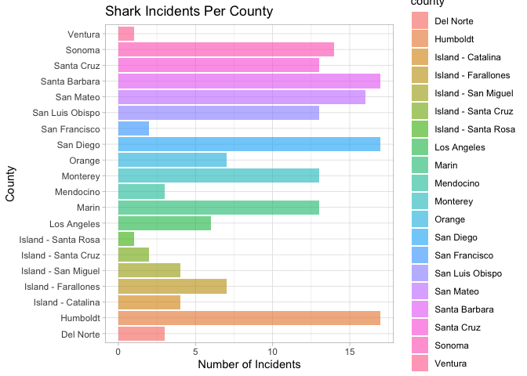
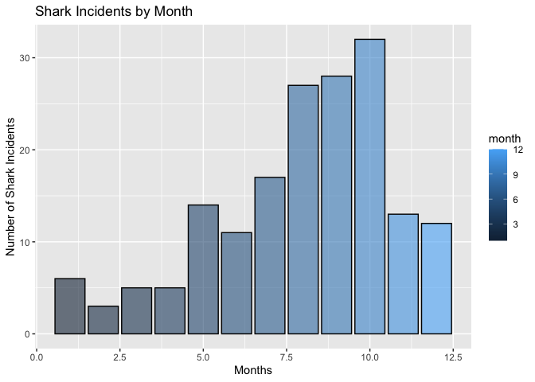
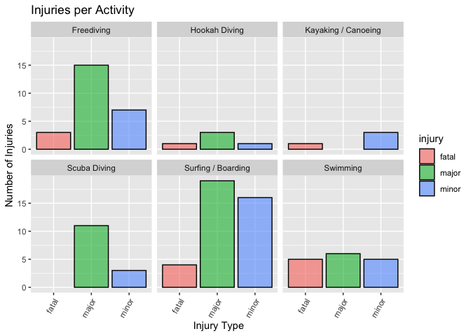
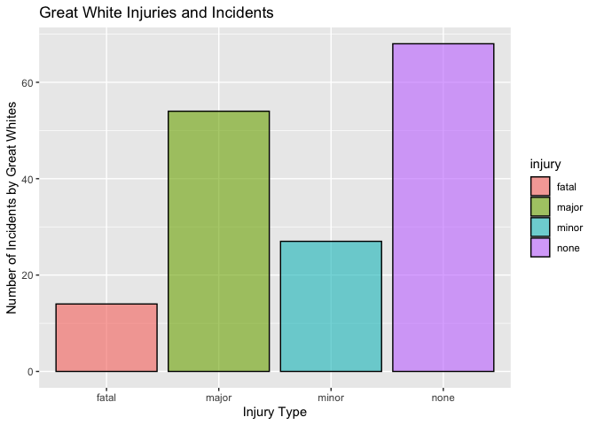
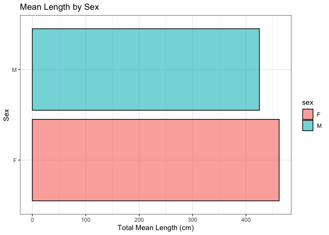
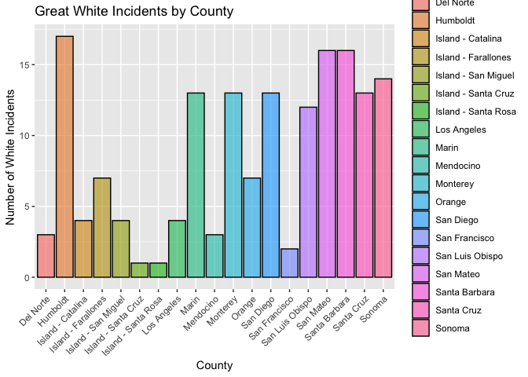

## Instructions
Answer the following questions and complete the exercises in RMarkdown. Please embed all of your code and push your final work to your repository. Your code must be organized, clean, and run free from errors. Remember, you must remove the `#` for any included code chunks to run. Be sure to add your name to the author header above. 

Your code must knit in order to be considered. If you are stuck and cannot answer a question, then comment out your code and knit the document. You may use your notes, labs, and homework to help you complete this exam. Do not use any other resources- including AI assistance.  

Don't forget to answer any questions that are asked in the prompt. Some questions will require a plot, but others do not- make sure to read each question carefully.  

For the questions that require a plot, make sure to have clearly labeled axes and a title. Keep your plots clean and professional-looking, but you are free to add color and other aesthetics.  

Be sure to follow the directions and upload your exam on Gradescope.    

## Background
In the `data` folder, you will find data about shark incidents in California between 1950-2022. The [data](https://catalog.data.gov/dataset/shark-incident-database-california-56167) are from: State of California- Shark Incident Database.   

## Load the libraries

```r
library("tidyverse")
library("janitor")
library("naniar")
```

## Load the data
Run the following code chunk to import the data.

```r
sharks <- read_csv("data/SharkIncidents_1950_2022_220302.csv") %>% clean_names()
```

## Questions
1. (1 point) Start by doing some data exploration using your preferred function(s). What is the structure of the data? Where are the missing values and how are they represented?  

```r
names(sharks)
```

```
##  [1] "incident_num"     "month"            "day"              "year"            
##  [5] "time"             "county"           "location"         "mode"            
##  [9] "injury"           "depth"            "species"          "comment"         
## [13] "longitude"        "latitude"         "confirmed_source" "wfl_case_number"
```


```r
glimpse(sharks)
```

```
## Rows: 211
## Columns: 16
## $ incident_num     <chr> "1", "2", "3", "4", "5", "6", "7", "8", "9", "10", "1…
## $ month            <dbl> 10, 5, 12, 2, 8, 4, 10, 5, 6, 7, 10, 11, 4, 5, 5, 8, …
## $ day              <dbl> 8, 27, 7, 6, 14, 28, 12, 7, 14, 28, 4, 10, 24, 19, 21…
## $ year             <dbl> 1950, 1952, 1952, 1955, 1956, 1957, 1958, 1959, 1959,…
## $ time             <chr> "12:00", "14:00", "14:00", "12:00", "16:30", "13:30",…
## $ county           <chr> "San Diego", "San Diego", "Monterey", "Monterey", "Sa…
## $ location         <chr> "Imperial Beach", "Imperial Beach", "Lovers Point", "…
## $ mode             <chr> "Swimming", "Swimming", "Swimming", "Freediving", "Sw…
## $ injury           <chr> "major", "minor", "fatal", "minor", "major", "fatal",…
## $ depth            <chr> "surface", "surface", "surface", "surface", "surface"…
## $ species          <chr> "White", "White", "White", "White", "White", "White",…
## $ comment          <chr> "Body Surfing, bit multiple times on leg, thigh and b…
## $ longitude        <chr> "-117.1466667", "-117.2466667", "-122.05", "-122.15",…
## $ latitude         <dbl> 32.58833, 32.58833, 36.62667, 36.62667, 35.13833, 35.…
## $ confirmed_source <chr> "Miller/Collier, Coronado Paper, Oceanside Paper", "G…
## $ wfl_case_number  <chr> NA, NA, NA, NA, NA, NA, NA, NA, NA, NA, NA, NA, NA, N…
```

```r
miss_var_summary(sharks)
```

```
## # A tibble: 16 × 3
##    variable         n_miss pct_miss
##    <chr>             <int>    <dbl>
##  1 wfl_case_number     202   95.7  
##  2 time                  7    3.32 
##  3 latitude              6    2.84 
##  4 longitude             5    2.37 
##  5 confirmed_source      1    0.474
##  6 incident_num          0    0    
##  7 month                 0    0    
##  8 day                   0    0    
##  9 year                  0    0    
## 10 county                0    0    
## 11 location              0    0    
## 12 mode                  0    0    
## 13 injury                0    0    
## 14 depth                 0    0    
## 15 species               0    0    
## 16 comment               0    0
```


```r
summary(sharks)
```

```
##  incident_num           month             day             year     
##  Length:211         Min.   : 1.000   Min.   : 1.00   Min.   :1950  
##  Class :character   1st Qu.: 6.000   1st Qu.: 7.50   1st Qu.:1985  
##  Mode  :character   Median : 8.000   Median :18.00   Median :2004  
##                     Mean   : 7.858   Mean   :16.54   Mean   :1998  
##                     3rd Qu.:10.000   3rd Qu.:25.00   3rd Qu.:2014  
##                     Max.   :12.000   Max.   :31.00   Max.   :2022  
##                                                                    
##      time              county            location             mode          
##  Length:211         Length:211         Length:211         Length:211        
##  Class :character   Class :character   Class :character   Class :character  
##  Mode  :character   Mode  :character   Mode  :character   Mode  :character  
##                                                                             
##                                                                             
##                                                                             
##                                                                             
##     injury             depth             species            comment         
##  Length:211         Length:211         Length:211         Length:211        
##  Class :character   Class :character   Class :character   Class :character  
##  Mode  :character   Mode  :character   Mode  :character   Mode  :character  
##                                                                             
##                                                                             
##                                                                             
##                                                                             
##   longitude            latitude     confirmed_source   wfl_case_number   
##  Length:211         Min.   :32.59   Length:211         Length:211        
##  Class :character   1st Qu.:34.04   Class :character   Class :character  
##  Mode  :character   Median :36.70   Mode  :character   Mode  :character  
##                     Mean   :36.36                                        
##                     3rd Qu.:38.18                                        
##                     Max.   :41.56                                        
##                     NA's   :6
```
Given we do not see any extreme values in the min and max, there are no number placeholders for NA. We do see placeholders in the forms of `not counted` and `unknown` that will have to be accounted for. 

2. (1 point) Notice that there are some incidents identified as "NOT COUNTED". These should be removed from the data because they were either not sharks, unverified, or were provoked. It's OK to replace the `sharks` object.


```r
names(sharks)
```

```
##  [1] "incident_num"     "month"            "day"              "year"            
##  [5] "time"             "county"           "location"         "mode"            
##  [9] "injury"           "depth"            "species"          "comment"         
## [13] "longitude"        "latitude"         "confirmed_source" "wfl_case_number"
```


```r
sharks <- sharks %>% 
  filter(!incident_num == "NOT COUNTED") %>% 
  filter(!time == "Unknown") %>% 
  filter(!species == "Unknown")
#sharks
```

3. (3 points) Are there any "hotspots" for shark incidents in California? Make a plot that shows the total number of incidents per county. Which county has the highest number of incidents?

*Data*

```r
sharks %>% 
  select(location,county,injury,incident_num) %>% 
  group_by(county) %>% 
  summarise(n_incidents=n_distinct(incident_num)) %>% 
  arrange(desc(n_incidents))
```

```
## # A tibble: 20 × 2
##    county              n_incidents
##    <chr>                     <int>
##  1 Humboldt                     17
##  2 San Diego                    17
##  3 Santa Barbara                17
##  4 San Mateo                    16
##  5 Sonoma                       14
##  6 Marin                        13
##  7 Monterey                     13
##  8 San Luis Obispo              13
##  9 Santa Cruz                   13
## 10 Island - Farallones           7
## 11 Orange                        7
## 12 Los Angeles                   6
## 13 Island - Catalina             4
## 14 Island - San Miguel           4
## 15 Del Norte                     3
## 16 Mendocino                     3
## 17 Island - Santa Cruz           2
## 18 San Francisco                 2
## 19 Island - Santa Rosa           1
## 20 Ventura                       1
```
We can see that the Humboldt, Santa Barbara, and San Diego county are "hotspots" for shark incidents, and has 17 distinct incidents marked in the data. 
 
*Plot*

```r
sharks %>% 
  select(location,county,injury,incident_num) %>% 
  group_by(location,county) %>% 
  summarise(n_incidents=n_distinct(incident_num)) %>% 
  arrange(desc(n_incidents)) %>% 
  ggplot(aes(x=n_incidents,y=county,fill=county))+
  geom_col(na.rm=T,alpha=0.6)+
  labs(title="Shark Incidents Per County",
      x= "Number of Incidents",
      y= "County")+
  theme_light()
```

```
## `summarise()` has grouped output by 'location'. You can override using the
## `.groups` argument.
```

<!-- -->
4. (3 points) Are there months of the year when incidents are more likely to occur? Make a plot that shows the total number of incidents by month. Which month has the highest number of incidents?  

*Data*

```r
sharks %>% 
  group_by(month) %>% 
  summarise(n_incidents=n_distinct(incident_num))
```

```
## # A tibble: 12 × 2
##    month n_incidents
##    <dbl>       <int>
##  1     1           6
##  2     2           3
##  3     3           5
##  4     4           5
##  5     5          14
##  6     6          11
##  7     7          17
##  8     8          27
##  9     9          28
## 10    10          32
## 11    11          13
## 12    12          12
```
Month 10 (aka October) is recorded to have the most distinct counts of incidents at 32. Yikes. 

*Plot*

```r
sharks %>% 
  group_by(month) %>% 
  summarise(n_incidents=n_distinct(incident_num)) %>% 
  ggplot(aes(x=month,y=n_incidents,fill=month))+
  geom_col(color="black",alpha=0.6)+
  labs(title= "Shark Incidents by Month",
       x= "Months",
       y="Number of Shark Incidents")+
  theme_get()
```

<!-- -->

5. (3 points) How do the number and types of injuries compare by county? Make a table (not a plot) that shows the number of injury types by county. Which county has the highest number of fatalities?


```r
sharks %>% 
  select(county,incident_num,injury) %>% 
  filter(injury =="fatal") %>% 
  group_by(county) %>% 
  count(injury) %>% 
  arrange(desc(n))
```

```
## # A tibble: 10 × 3
## # Groups:   county [10]
##    county              injury     n
##    <chr>               <chr>  <int>
##  1 San Luis Obispo     fatal      3
##  2 San Diego           fatal      2
##  3 Santa Barbara       fatal      2
##  4 Island - San Miguel fatal      1
##  5 Los Angeles         fatal      1
##  6 Mendocino           fatal      1
##  7 Monterey            fatal      1
##  8 San Francisco       fatal      1
##  9 San Mateo           fatal      1
## 10 Santa Cruz          fatal      1
```
The San Luis Obispo county has the most number of injuries categorized as "fatal". 

6. (2 points) In the data, `mode` refers to a type of activity. Which activity is associated with the highest number of incidents?


```r
sharks %>% 
  select(county,injury,mode,incident_num) %>% 
  filter(injury!="none") %>% 
  group_by(mode) %>% 
  count(injury) %>% 
  arrange(desc(n))
```

```
## # A tibble: 16 × 3
## # Groups:   mode [6]
##    mode                injury     n
##    <chr>               <chr>  <int>
##  1 Surfing / Boarding  major     19
##  2 Surfing / Boarding  minor     16
##  3 Freediving          major     15
##  4 Scuba Diving        major     11
##  5 Freediving          minor      7
##  6 Swimming            major      6
##  7 Swimming            fatal      5
##  8 Swimming            minor      5
##  9 Surfing / Boarding  fatal      4
## 10 Freediving          fatal      3
## 11 Hookah Diving       major      3
## 12 Kayaking / Canoeing minor      3
## 13 Scuba Diving        minor      3
## 14 Hookah Diving       fatal      1
## 15 Hookah Diving       minor      1
## 16 Kayaking / Canoeing fatal      1
```
Surfing and boarding had the highest number of incidents with injuries labeled as either minor or major. 

7. (4 points) Use faceting to make a plot that compares the number and types of injuries by activity. (hint: the x axes should be the type of injury) 

```r
sharks %>% 
  select(county,injury,mode,incident_num) %>% 
  filter(injury!="none") %>% 
  group_by(mode) %>% 
  count(injury) %>% 
  ggplot(aes(x=injury,y=n,fill=injury))+
  geom_col(color="black",alpha=0.6)+
  facet_wrap(~mode)+
  theme(axis.text.x=element_text(angle=60,hjust = 1))+
  labs(title="Injuries per Activity",
       x=" Injury Type",
       y="Number of Injuries")
```

<!-- -->

8. (1 point) Which shark species is involved in the highest number of incidents?  

```r
sharks %>% 
  select(species,incident_num) %>% 
  filter(species!="NA") %>% 
  filter(species!="Unknown") %>% 
  filter(incident_num!="NA") %>% 
  group_by(species) %>% 
  summarise(total_incidents=n_distinct(incident_num)) %>% 
  arrange(desc(total_incidents))
```

```
## # A tibble: 7 × 2
##   species    total_incidents
##   <chr>                <int>
## 1 White                  163
## 2 Hammerhead               3
## 3 Blue                     2
## 4 Leopard                  2
## 5 Salmon                   1
## 6 Sevengill                1
## 7 Thresher                 1
```
By a landslide, the White shark species has the highest total number of incidents. 

9. (3 points) Are all incidents involving Great White's fatal? Make a plot that shows the number and types of injuries for Great White's only.  

```r
sharks %>% 
  select(species, incident_num, injury) %>% 
  filter(species=="White") %>% 
  filter(injury!="NA") %>% 
  group_by(injury) %>%
  summarise(incident_total=n_distinct(incident_num)) %>% 
  arrange(desc(incident_total)) %>% 
  ggplot(aes(x=injury,y=incident_total,fill=injury))+
  geom_col(color="black",alpha=0.6)+
  labs(title = "Great White Injuries and Incidents",
       x="Injury Type",
       y="Number of Incidents by Great Whites")+
  theme_grey()
```

<!-- -->
No, not all the injuries from the Great White are considered fatal. 

## Background
Let's learn a little bit more about Great White sharks by looking at a small dataset that tracked 20 Great White's in the Fallaron Islands. The [data](https://link.springer.com/article/10.1007/s00227-007-0739-4) are from: Weng et al. (2007) Migration and habitat of white sharks (_Carcharodon carcharias_) in the eastern Pacific Ocean.

## Load the data

```r
white_sharks <- read_csv("data/White sharks tracked from Southeast Farallon Island, CA, USA, 1999 2004.csv", na = c("?", "n/a")) %>% clean_names()
```

10. (1 point) Start by doing some data exploration using your preferred function(s). What is the structure of the data? Where are the missing values and how are they represented?

```r
names(white_sharks)
```

```
##  [1] "shark"           "tagging_date"    "total_length_cm" "sex"            
##  [5] "maturity"        "pop_up_date"     "track_days"      "longitude"      
##  [9] "latitude"        "comment"
```


```r
glimpse(white_sharks)
```

```
## Rows: 20
## Columns: 10
## $ shark           <chr> "1-M", "2-M", "3-M", "4-M", "5-F", "6-M", "7-F", "8-M"…
## $ tagging_date    <chr> "19-Oct-99", "30-Oct-99", "16-Oct-00", "5-Nov-01", "5-…
## $ total_length_cm <dbl> 402, 366, 457, 457, 488, 427, 442, 380, 450, 530, 427,…
## $ sex             <chr> "M", "M", "M", "M", "F", "M", "F", "M", "M", "F", NA, …
## $ maturity        <chr> "Mature", "Adolescent", "Mature", "Mature", "Mature", …
## $ pop_up_date     <chr> "2-Nov-99", "25-Nov-99", "16-Apr-01", "6-May-02", "19-…
## $ track_days      <dbl> 14, 26, 182, 182, 256, 275, 35, 60, 209, 91, 182, 240,…
## $ longitude       <dbl> -124.49, -125.97, -156.80, -141.47, -133.25, -138.83, …
## $ latitude        <dbl> 38.95, 38.69, 20.67, 26.39, 21.13, 26.50, 37.07, 34.93…
## $ comment         <chr> "Nearshore", "Nearshore", "To Hawaii", "To Hawaii", "O…
```

```r
miss_var_summary(white_sharks)
```

```
## # A tibble: 10 × 3
##    variable        n_miss pct_miss
##    <chr>            <int>    <dbl>
##  1 sex                  3       15
##  2 maturity             1        5
##  3 longitude            1        5
##  4 latitude             1        5
##  5 shark                0        0
##  6 tagging_date         0        0
##  7 total_length_cm      0        0
##  8 pop_up_date          0        0
##  9 track_days           0        0
## 10 comment              0        0
```
It seems that all NAs are accounted for and not hidden with placeholders. 

11. (3 points) How do male and female sharks compare in terms of total length? Are males or females larger on average? Do a quick search online to verify your findings. (hint: this is a table, not a plot).  


```r
white_sharks %>% 
  select(shark,sex,total_length_cm) %>% 
  filter(sex!="NA") %>% 
  group_by(sex) %>% 
  summarise(mean_length=mean(total_length_cm))
```

```
## # A tibble: 2 × 2
##   sex   mean_length
##   <chr>       <dbl>
## 1 F            462 
## 2 M            425.
```
As shown above, the female sharks, on average, have a larger length. This is confirmed by Google! 

12. (3 points) Make a plot that compares the range of total length by sex. 

```r
white_sharks %>% 
  select(shark,sex,total_length_cm) %>% 
  filter(sex!="NA") %>% 
  group_by(sex) %>% 
  summarise(mean_length=mean(total_length_cm)) %>% 
  ggplot(aes(x=mean_length,y=sex,fill=sex))+
  geom_col(color="black",alpha=0.6)+
  labs(title="Mean Length by Sex",
       x="Total Mean Length (cm)",
       y="Sex")+
  theme_bw()
```

<!-- -->

13. (2 points) Using the `sharks` or the `white_sharks` data, what is one question that you are interested in exploring? Write the question and answer it using a plot or table. 

*My question* From the `sharks` data, which county had the greatest number of White shark incidents? 

*Data*

```r
sharks %>% 
  select(county,location,incident_num,species) %>% 
  filter(species=="White") %>% 
  group_by(county) %>%
  summarise(total_incidents=n_distinct(incident_num)) %>% 
  arrange(desc(total_incidents))
```

```
## # A tibble: 19 × 2
##    county              total_incidents
##    <chr>                         <int>
##  1 Humboldt                         17
##  2 San Mateo                        16
##  3 Santa Barbara                    16
##  4 Sonoma                           14
##  5 Marin                            13
##  6 Monterey                         13
##  7 San Diego                        13
##  8 Santa Cruz                       13
##  9 San Luis Obispo                  12
## 10 Island - Farallones               7
## 11 Orange                            7
## 12 Island - Catalina                 4
## 13 Island - San Miguel               4
## 14 Los Angeles                       4
## 15 Del Norte                         3
## 16 Mendocino                         3
## 17 San Francisco                     2
## 18 Island - Santa Cruz               1
## 19 Island - Santa Rosa               1
```

*Plot*

```r
sharks %>% 
  select(county,location,incident_num,species) %>% 
  filter(species=="White") %>% 
  group_by(county) %>%
  summarise(total_incidents=n_distinct(incident_num)) %>% 
  arrange(desc(total_incidents)) %>% 
  ggplot(aes(x=county,y=total_incidents,fill=county))+
  geom_col(color="black",alpha=0.6)+
  labs(title="Great White Incidents by County",
       x="County",
       y="Number of White Incidents")+
  theme(axis.text.x=element_text(angle=45,hjust=1))
```

<!-- -->
If we are just interested in the number of incidents caused by Great Whites in the data, Humboldt is the county that has the highest number of incidents. 
