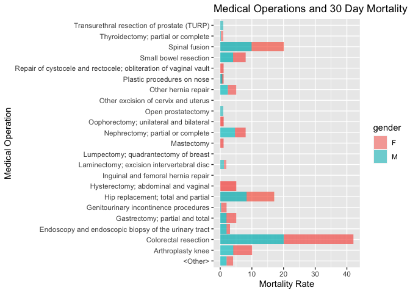

## Instructions
Answer the following questions and complete the exercises in RMarkdown. Please embed all of your code and push your final work to your repository. Your code should be organized, clean, and run free from errors. Remember, you must remove the `#` for any included code chunks to run. Be sure to add your name to the author header above.  

Make sure to use the formatting conventions of RMarkdown to make your report neat and clean! Use the tidyverse and pipes unless otherwise indicated. To receive full credit, all plots must have clearly labeled axes, a title, and consistent aesthetics. This exam is worth a total of 35 points. 

Please load the following libraries.

```r
library("tidyverse")
library("janitor")
library("naniar")
```

## Data
These data are from a study on surgical residents. The study was originally published by Sessier et al. “Operation Timing and 30-Day Mortality After Elective General Surgery”. Anesth Analg 2011; 113: 1423-8. The data were cleaned for instructional use by Amy S. Nowacki, “Surgery Timing Dataset”, TSHS Resources Portal (2016). Available at https://www.causeweb.org/tshs/surgery-timing/.

Descriptions of the variables and the study are included as pdf's in the data folder.  

Please run the following chunk to import the data.

```r
surgery <- read_csv("data/surgery.csv")
```

1. Use the summary function(s) of your choice to explore the data and get an idea of its structure. Please also check for NA's.

```r
names(surgery)
```

```
##  [1] "ahrq_ccs"            "age"                 "gender"             
##  [4] "race"                "asa_status"          "bmi"                
##  [7] "baseline_cancer"     "baseline_cvd"        "baseline_dementia"  
## [10] "baseline_diabetes"   "baseline_digestive"  "baseline_osteoart"  
## [13] "baseline_psych"      "baseline_pulmonary"  "baseline_charlson"  
## [16] "mortality_rsi"       "complication_rsi"    "ccsmort30rate"      
## [19] "ccscomplicationrate" "hour"                "dow"                
## [22] "month"               "moonphase"           "mort30"             
## [25] "complication"
```

```r
glimpse(surgery)
```

```
## Rows: 32,001
## Columns: 25
## $ ahrq_ccs            <chr> "<Other>", "<Other>", "<Other>", "<Other>", "<Othe…
## $ age                 <dbl> 67.8, 39.5, 56.5, 71.0, 56.3, 57.7, 56.6, 64.2, 66…
## $ gender              <chr> "M", "F", "F", "M", "M", "F", "M", "F", "M", "F", …
## $ race                <chr> "Caucasian", "Caucasian", "Caucasian", "Caucasian"…
## $ asa_status          <chr> "I-II", "I-II", "I-II", "III", "I-II", "I-II", "IV…
## $ bmi                 <dbl> 28.04, 37.85, 19.56, 32.22, 24.32, 40.30, 64.57, 4…
## $ baseline_cancer     <chr> "No", "No", "No", "No", "Yes", "No", "No", "No", "…
## $ baseline_cvd        <chr> "Yes", "Yes", "No", "Yes", "No", "Yes", "Yes", "Ye…
## $ baseline_dementia   <chr> "No", "No", "No", "No", "No", "No", "No", "No", "N…
## $ baseline_diabetes   <chr> "No", "No", "No", "No", "No", "No", "Yes", "No", "…
## $ baseline_digestive  <chr> "Yes", "No", "No", "No", "No", "No", "No", "No", "…
## $ baseline_osteoart   <chr> "No", "No", "No", "No", "No", "No", "No", "No", "N…
## $ baseline_psych      <chr> "No", "No", "No", "No", "No", "Yes", "No", "No", "…
## $ baseline_pulmonary  <chr> "No", "No", "No", "No", "No", "No", "No", "No", "N…
## $ baseline_charlson   <dbl> 0, 0, 0, 0, 0, 0, 2, 0, 1, 2, 0, 1, 0, 0, 0, 0, 0,…
## $ mortality_rsi       <dbl> -0.63, -0.63, -0.49, -1.38, 0.00, -0.77, -0.36, -0…
## $ complication_rsi    <dbl> -0.26, -0.26, 0.00, -1.15, 0.00, -0.84, -1.34, 0.0…
## $ ccsmort30rate       <dbl> 0.0042508, 0.0042508, 0.0042508, 0.0042508, 0.0042…
## $ ccscomplicationrate <dbl> 0.07226355, 0.07226355, 0.07226355, 0.07226355, 0.…
## $ hour                <dbl> 9.03, 18.48, 7.88, 8.80, 12.20, 7.67, 9.53, 7.52, …
## $ dow                 <chr> "Mon", "Wed", "Fri", "Wed", "Thu", "Thu", "Tue", "…
## $ month               <chr> "Nov", "Sep", "Aug", "Jun", "Aug", "Dec", "Apr", "…
## $ moonphase           <chr> "Full Moon", "New Moon", "Full Moon", "Last Quarte…
## $ mort30              <chr> "No", "No", "No", "No", "No", "No", "No", "No", "N…
## $ complication        <chr> "No", "No", "No", "No", "No", "No", "No", "Yes", "…
```

```r
sum(is.na(surgery))
```

```
## [1] 3783
```


```r
miss_var_summary(surgery)
```

```
## # A tibble: 25 × 3
##    variable          n_miss pct_miss
##    <chr>              <int>    <dbl>
##  1 bmi                 3290 10.3    
##  2 race                 480  1.50   
##  3 asa_status             8  0.0250 
##  4 gender                 3  0.00937
##  5 age                    2  0.00625
##  6 ahrq_ccs               0  0      
##  7 baseline_cancer        0  0      
##  8 baseline_cvd           0  0      
##  9 baseline_dementia      0  0      
## 10 baseline_diabetes      0  0      
## # ℹ 15 more rows
```

2. Let's explore the participants in the study. Show a count of participants by race AND make a plot that visually represents your output.

```r
surgery %>% 
  count(race) %>% 
  arrange(desc(n))
```

```
## # A tibble: 4 × 2
##   race                 n
##   <chr>            <int>
## 1 Caucasian        26488
## 2 African American  3790
## 3 Other             1243
## 4 <NA>               480
```


```r
surgery %>% 
  ggplot(aes(x=race,fill=race))+
  geom_bar(alpha=0.75)+
  labs(title = "Race Composition",
       x="Race",
       y= "Number of Individuals")
```

<!-- -->

3. What is the mean age of participants by gender? (hint: please provide a number for each) Since only three participants do not have gender indicated, remove these participants from the data.

```r
surgery %>% 
  filter(gender!="NA") %>% 
  group_by(gender) %>% 
  summarise(mean_age=mean(age,na.rm=T))
```

```
## # A tibble: 2 × 2
##   gender mean_age
##   <chr>     <dbl>
## 1 F          56.7
## 2 M          58.8
```


```r
surgery %>% 
  filter(gender!="NA") %>% 
  group_by(gender) %>% 
  summarise(mean_age=mean(age,na.rm=T)) %>% 
  ggplot(aes(x=gender,
             y=mean_age,
             fill=gender))+
  geom_col(na.rm=T,
           alpha=0.6,
           color="black")+
  labs(title= "Average Age per Gender",
       x="Gender",
       y="Average Age")
```

<!-- -->

4. Make a plot that shows the range of age associated with gender.

```r
surgery %>%
  filter(!gender=="NA") %>% 
  ggplot(aes(x=gender,
             y=age,
             fill=gender))+
  geom_boxplot(na.rm = T,
               alpha=0.6)+
  labs(title= "Age Range Gender",
       x="Gender",
       y="Age Range")
```

<!-- -->
IMPORTANT: When using the `fill` function do NOT use "". Type the variable you wish to color by AS IS with no quotation marks or else R will not be able to recognize it 

5. How healthy are the participants? The variable `asa_status` is an evaluation of patient physical status prior to surgery. Lower numbers indicate fewer comorbidities (presence of two or more diseases or medical conditions in a patient). Make a plot that compares the number of `asa_status` I-II, III, and IV-V.


```r
surgery %>%
  filter(!gender =="NA") %>%
  ggplot(aes(x=asa_status,
             fill=gender))+
  geom_bar(na.rm=T,
           alpha=0.6,
           color="black")+
  labs(title = "Health Range by Gender of Participants",
       x= "Health Status",
       y= "Number of Individuals")
```

<!-- -->

6. Create a plot that displays the distribution of body mass index for each `asa_status` as a probability distribution- not a histogram. (hint: use faceting!)

```r
names(surgery)
```

```
##  [1] "ahrq_ccs"            "age"                 "gender"             
##  [4] "race"                "asa_status"          "bmi"                
##  [7] "baseline_cancer"     "baseline_cvd"        "baseline_dementia"  
## [10] "baseline_diabetes"   "baseline_digestive"  "baseline_osteoart"  
## [13] "baseline_psych"      "baseline_pulmonary"  "baseline_charlson"  
## [16] "mortality_rsi"       "complication_rsi"    "ccsmort30rate"      
## [19] "ccscomplicationrate" "hour"                "dow"                
## [22] "month"               "moonphase"           "mort30"             
## [25] "complication"
```


```r
surgery %>%
  filter(!bmi=="NA") %>% 
  filter(!asa_status=="NA") %>% 
  filter(!gender=="NA") %>% 
  ggplot(aes(x=bmi,
             y=asa_status,
             fill=gender))+
  geom_boxplot(alpha=0.6)+
  facet_wrap("asa_status")+
  labs(title = "Distribution of BMI per Health Status",
       x="BMI",
       y="Health Status")
```

<!-- -->

The variable `ccsmort30rate` is a measure of the overall 30-day mortality rate associated with each type of operation. The variable `ccscomplicationrate` is a measure of the 30-day in-hospital complication rate. The variable `ahrq_ccs` lists each type of operation.  

7. What are the 5 procedures associated with highest risk of 30-day mortality AND how do they compare with the 5 procedures with highest risk of complication? (hint: no need for a plot here)

```r
surgery %>% 
  select(ccsmort30rate,ccscomplicationrate,ahrq_ccs,gender) %>% 
  arrange(desc(ccsmort30rate))
```

```
## # A tibble: 32,001 × 4
##    ccsmort30rate ccscomplicationrate ahrq_ccs             gender
##            <dbl>               <dbl> <chr>                <chr> 
##  1        0.0167               0.312 Colorectal resection F     
##  2        0.0167               0.312 Colorectal resection M     
##  3        0.0167               0.312 Colorectal resection M     
##  4        0.0167               0.312 Colorectal resection F     
##  5        0.0167               0.312 Colorectal resection M     
##  6        0.0167               0.312 Colorectal resection F     
##  7        0.0167               0.312 Colorectal resection F     
##  8        0.0167               0.312 Colorectal resection F     
##  9        0.0167               0.312 Colorectal resection M     
## 10        0.0167               0.312 Colorectal resection M     
## # ℹ 31,991 more rows
```
All of the procedures that fall into the top 5 rates for highest complications are colorectal resection.

8. Make a plot that compares the `ccsmort30rate` for all listed `ahrq_ccs` procedures.

```r
surgery %>% 
  filter(!gender =="NA") %>% 
  ggplot(aes(x=ccsmort30rate,
             y=ahrq_ccs,
             fill=gender))+ 
  geom_col(alpha=0.6)+
  labs(title= "Medical Operations and 30 Day Mortality Rates",
      x= "Mortality Rate",
      y= "Medical Operation")
```

<!-- -->

9. When is the best month to have surgery? Make a chart that shows the 30-day mortality and complications for the patients by month. `mort30` is the variable that shows whether or not a patient survived 30 days post-operation.


```r
surgery %>% 
  filter(!gender =="NA") %>% 
  select(ccsmort30rate,ccscomplicationrate,gender,month) %>% 
  arrange(ccsmort30rate)
```

```
## # A tibble: 31,998 × 4
##    ccsmort30rate ccscomplicationrate gender month
##            <dbl>               <dbl> <chr>  <chr>
##  1             0              0.0562 M      Sep  
##  2             0              0.0562 M      Jan  
##  3             0              0.0562 M      Mar  
##  4             0              0.0562 M      Apr  
##  5             0              0.0562 M      Jun  
##  6             0              0.0562 M      Jun  
##  7             0              0.0562 M      Apr  
##  8             0              0.0562 M      Feb  
##  9             0              0.0562 M      Feb  
## 10             0              0.0562 M      Jul  
## # ℹ 31,988 more rows
```

```r
surgery %>% 
  group_by(month) %>% 
  summarise(ccsmort30rate_total=sum(ccsmort30rate)) %>% 
  arrange(ccsmort30rate_total)
```

```
## # A tibble: 12 × 2
##    month ccsmort30rate_total
##    <chr>               <dbl>
##  1 Dec                  7.68
##  2 Jul                 10.0 
##  3 Feb                 10.7 
##  4 Nov                 11.0 
##  5 Mar                 11.3 
##  6 Jan                 11.5 
##  7 Oct                 11.6 
##  8 May                 11.6 
##  9 Apr                 11.6 
## 10 Jun                 13.0 
## 11 Sep                 13.9 
## 12 Aug                 14.1
```
As shown above, the month with the lowest mortality rate after operation is December. 


```r
surgery %>% 
  filter(!gender =="NA") %>% 
  ggplot(aes(x=mort30,
             y=ccscomplicationrate,
             fill=gender))+
  geom_boxplot(alpha=0.6)+
  facet_wrap(~month)+
  labs(title="Operation Complications and Survivors by Month",
       x="Patient Survival",
       y="Operation Complication Rate")
```

<!-- -->
Whether the patient survives or not depends on month and gender. 


10. Make a plot that visualizes the chart from question #9. Make sure that the months are on the x-axis. Do a search online and figure out how to order the months Jan-Dec.

```r
surgery %>% 
  filter(!gender =="NA") %>% 
  ggplot(aes(x=month,
             y=ccsmort30rate,
             fill=gender))+
  geom_col()+
  scale_x_discrete(limits=c("Jan","Feb","Mar", "Apr", "May", "Jun", "Jul", "Aug", "Sep", "Oct", "Nov", "Dec")) #puts the months in chronological order 
```

<!-- -->

Please be 100% sure your exam is saved, knitted, and pushed to your github repository. No need to submit a link on canvas, we will find your exam in your repository.
